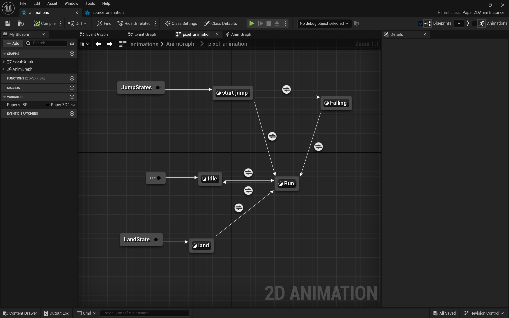

# 拆分动画：起跳-下落-落地

[TOC]

​	跳跃动画包含了`起跳-下落-落地`三个动作，但是持续时间可能与游戏character需要的不符。虽然可以通过修改持续时间来适配，但是更好的方法是将三个动作拆分出来，作为三个状态加入到动画状态机中。

## 1. 拆分与添加动画State

### 1. 在sequence中拆分动画

​	将原来的jump序列拆分为三个序列，仅保留对应的帧。

### 2. 添加到动画源（source）

### 3. 在动画状态机中创建 跳转节点（Jump）

### 4. 添加三个状态

​	与之前类似，添加play动画，注意取消loop。

​	设置转移条件：z轴方向速度小于0，可以从起跳进入到下落

​	最终状态机如图：

​	其中，land->run的条件是，当前动画播放完成。由于run与idle存在连接，因此不用再次添加land->idle。

## 2. 调用动画（Character）

​	在character中通过animation组件，跳转到对应状态节点来调用对应的animation。

### 跳跃与离开平台

​	这两个都可以归入跳跃状态节点，它们都应该进入跳跃或者下落的状态。

### 落地

## 3. 优化动画（落地滑行）

​	落地后会有一段时间滑行，原因在于，落地动画还未播放完成，但是已经进入到地面，movement组件允许进行移动，所以出现了滑行的动作（落地动画的最后一帧）。

​	针对此，解决方案有：

* 在落地动画未完成不允许移动
  * 设置一个character中的bool变量，表示是否可以移动
  * 默认可以移动
  * 播放落地动画时设置角色停止移动，并设置bool为false
  * 在动画机中，任何动画播放完成，设置该character的bool为true

在移动前检测是否可以移动：

着陆后停止移动并设置变量：

在动画播放完成后，设置角色can move：

* 更流畅设置：针对落地早些帧的广播——在落地的某一帧就通知全局，可以进行移动（而不是等动画完成再通知）

