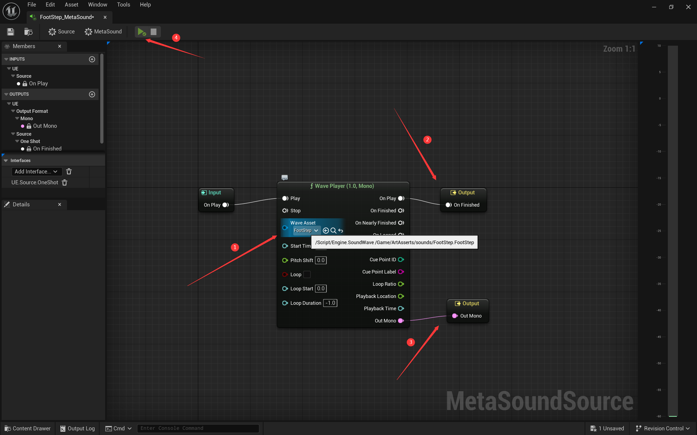
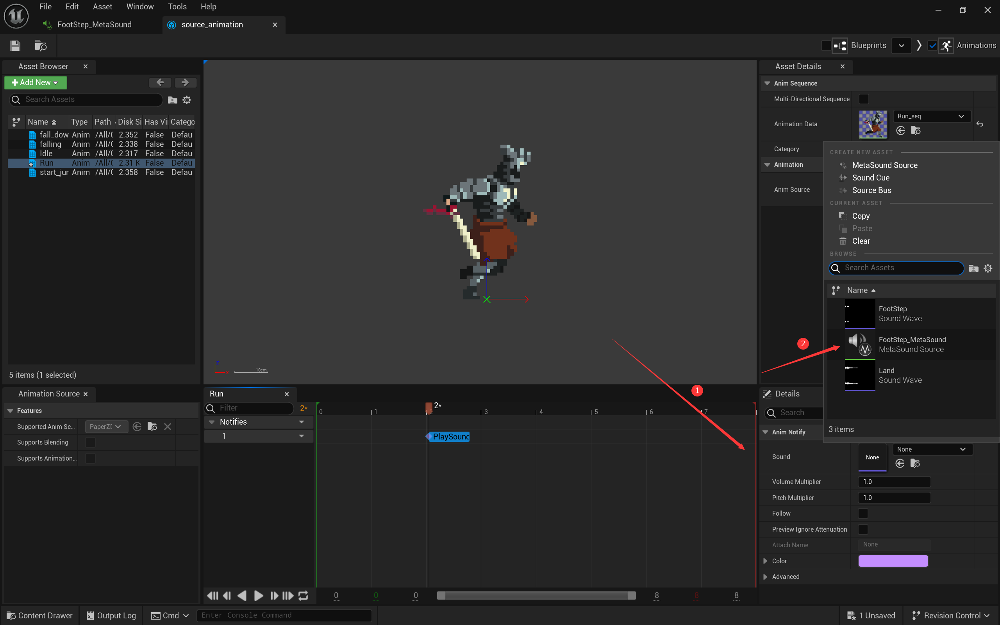

# 音效添加和使用

[TOC]

## 1. 导入

​	直接将wav文件拖入UE即可。

## 2. 修改音频

### MetaSoundSource

#### 创建蓝图

#### 设置单声道扬声器

#### 选择素材并设置输出

​	设置完成后可以运行来测试效果。

#### 增加变化（随机数）

## 3. 动画source中应用音效

​	在`animation source`中找到需要添加音效的动画，在对应关键帧处加入`Play Sound`。

​	选择需要添加的音效：

​	在左右脚落地时各添加一个脚本音效：

