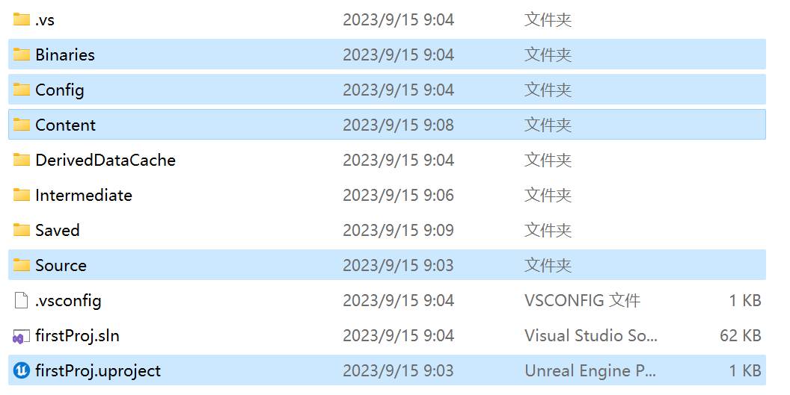

# 1. UE项目结构

* `.vs`：visual studio临时目录
* Binaries：UE编译好的二进制文件，C++的所有代码都会被编译到该目录下的dll中，通过热重载后被蓝图调用
* Config：工程的配置文件，可以直接改，也可以在编译器里改。
* Content：资源文件
* DerivedDataCache：缓存文件
* Intermediate：编译中间文件
* Saved：自动保存的文件
* Source：源代码文件

---

可以仅发送下面的文件：

