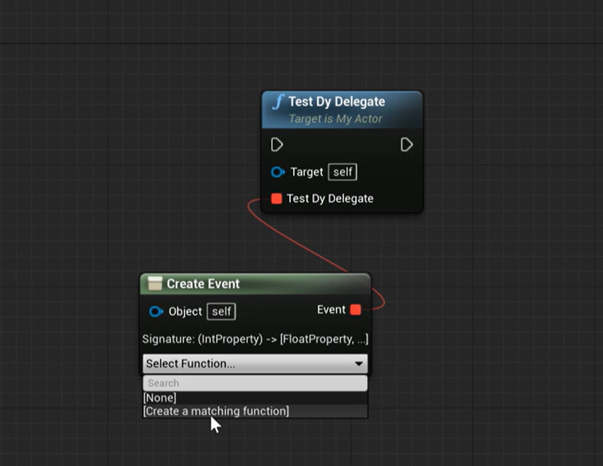

# 10. 动态代理

## 1. 动态单播代理

### 1.1 声明动态单播代理类型

​	其它和单播代理一样，但是动态单播代理主要在蓝图中使用，参数需要对应的参数名。

```C++
DECLARE_DYNAMIC_DELEGATE(FTestDyDelegate);
DECLARE_DYNAMIC_DELEGATE_RetVal_OneParam(float, FTestDyDelegate1P, int32, a);
```

### 1.2 创建动态单播代理

```C++
FTestDyDelegate DyDelegate;
```




### 1.3 绑定函数

```C++
DyDelegate.BindDynamic(this, &AMyActor::TestFunc);
```

## 2. 动态多播代理

### 2.1 声明动态多播代理类型

```C++
DECLARE_DYNAMIC_MULTICAST_DELEGATE(FTestDyMuDelegate);
```

### 2.2 创建动态多播代理

​	使用`UPROPERTY(BlueprintAssignable)`创建

```C++
UPROPERTY(BlueprintAssignable)
FTestDyMuDelegate TestDyMuDelegate;
```

### 2.3 绑定函数

​	注意：动态多播代理**绑定的函数必须是`UFUNCTION`**

```C++
TestDyMuDelegate.AddDynamic(this, &AMyActor::TestFunc); 
```

### 2.4 执行

```C++
TestDyMuDelegate.Broadcast();
```

