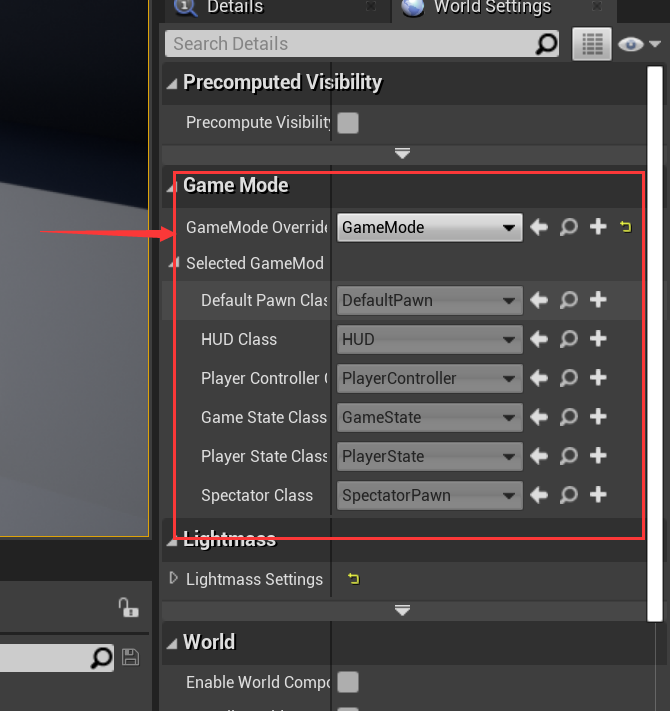
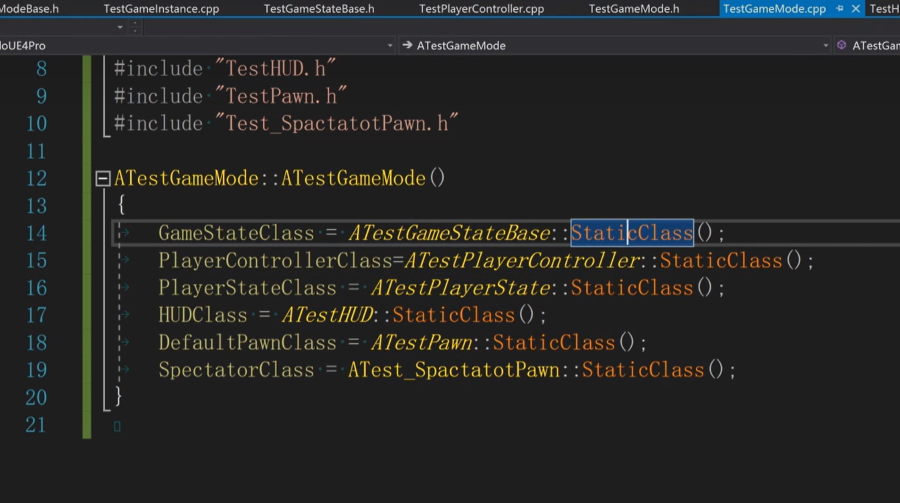

# 12. GamePlay框架在C++中如何填充

​	本说明目的在于讲清楚步骤。

## 1. 创建C++类

​	在C++文件夹下创建GamePlay框架的所有C++类，如图：

​	以及GameInstance类。

## 2. 在代码中填充到GameMode中

​	在GameMode的构造函数中，为这些成员变量（继承自`GameModeBase`，可在`GameModeBase.h`中查看）赋值：

## 3. 蓝图如何使用

​	一般C++用于创建大框架，而蓝图负责主要的业务逻辑实现。因此蓝图只要继承该C++类，新建一个蓝图类即可。