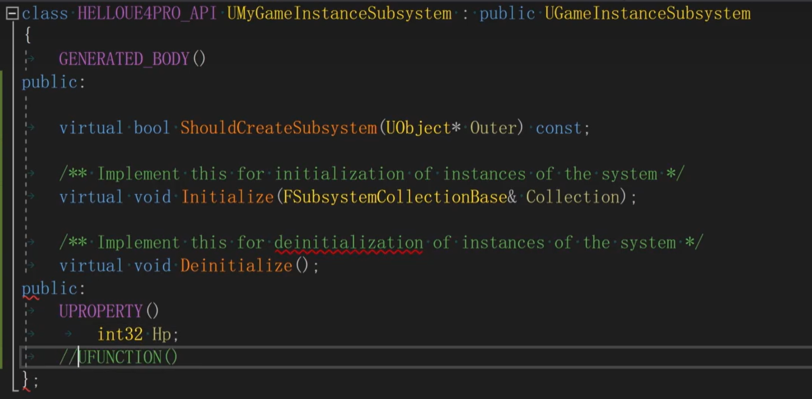

# 13. SubSystem使用

[《InsideUE4》GamePlay架构（十一）Subsystems - 知乎 (zhihu.com)](https://zhuanlan.zhihu.com/p/158717151)

​	4.22版本引入该系统，4.24版本完善该系统。

## 1. SubSystem的必要性

​	在GameInstance中，如果所有的资源管理都由一堆单例管理类来完成，那么很容易写错，并且不能保证全局唯一。

​	由此引入SubSystem系统来执行这些单例管理器类的职责。

​	**Subsystems是一套可以定义自动实例化和释放的类的框架。**

​	下面说明的Subsystem的种类，并且Subsystem的生命周期一般与GameInstance同时创建卸载。

## 2. SubSystem的类型

​	SubSystem有如下几类：

* `UEngineSubsystem`:代表引擎，数量1，Editor或Runtime模式都是全局唯一，从进程开始创建，进程退出时销毁。
* `UEditorSubsystem`:代表编辑器，数量1，只在编辑器下存在且全局唯一，从编辑器启动开始创建，到编辑器退出时销毁。
* `UGameInstanceSubsystem`:代表一场游戏，数量1，从游戏启动开始创建，游戏退出时销毁。这里的一场游戏指的是Runtime或者PIE模式运行。一场游戏可能会创建多个World切换。
* `UWorldSubsystem`:代表一个世界，数量可能>1，其生命周期跟归属的World有关。
* `ULocalPlayerSubsystem`:代表本地玩家，数量可能>1。UE支持本地分屏多玩家类型的游戏，但往往最常见的只有一个。LocalPlayer虽然往往和PlayerController一起访问，但是其生命周期其实是跟UGameInstance一起的（即默认一开始就创建好一定数量的本地玩家），或者更准确地说，是跟LocalPlayer的具体数量挂钩的。

## 3. Subsystem的使用

​	创建一个Subsystem的C++类，并实现如下三个函数：

* ShouldCreateSubsystem：一般实现为调用父类（Super）的该方法，并返回true
* Initialize：一般实现为调用父类（Super）的该方法，再进行自己的资源创建活动
* Deinitialize：一般实现为调用父类（Super）的该方法，再进行自己的资源销毁活动

