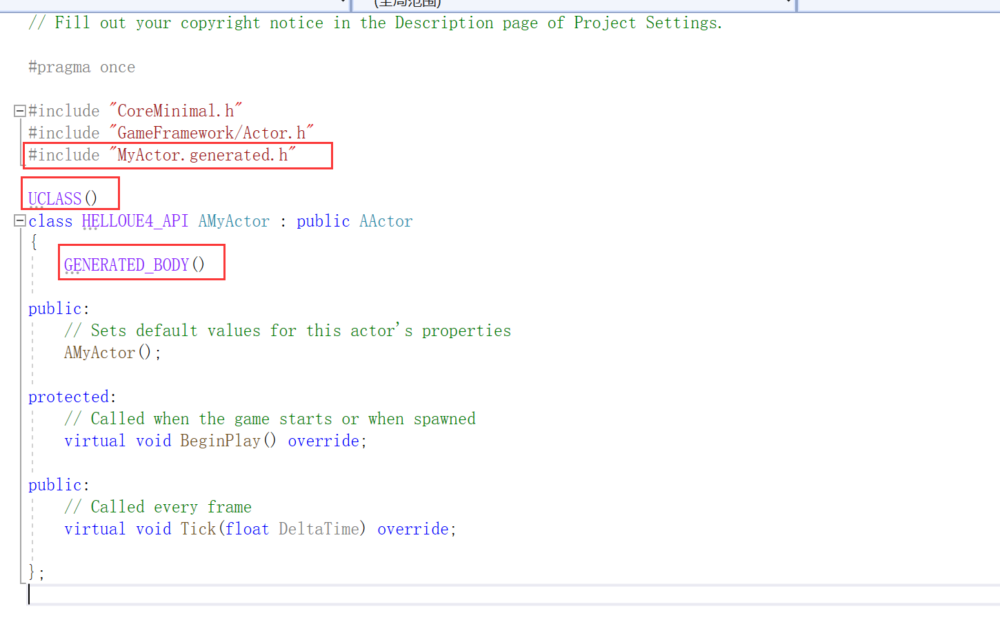
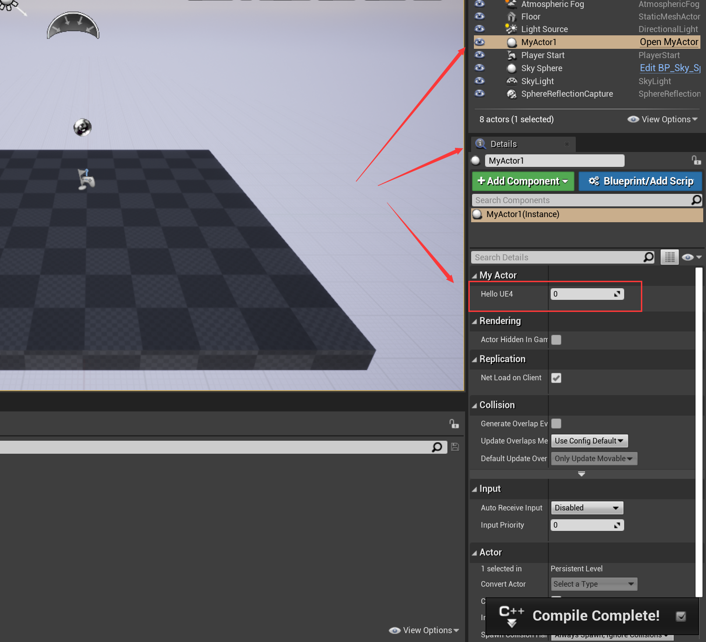
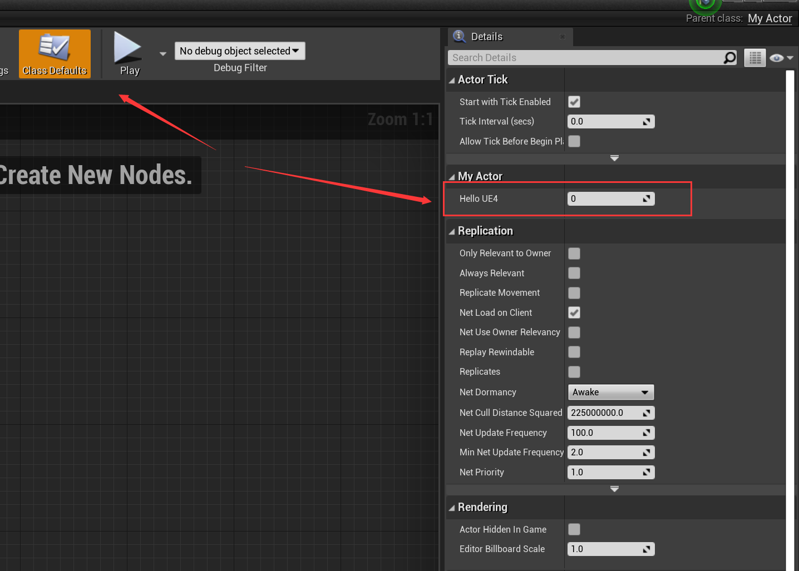
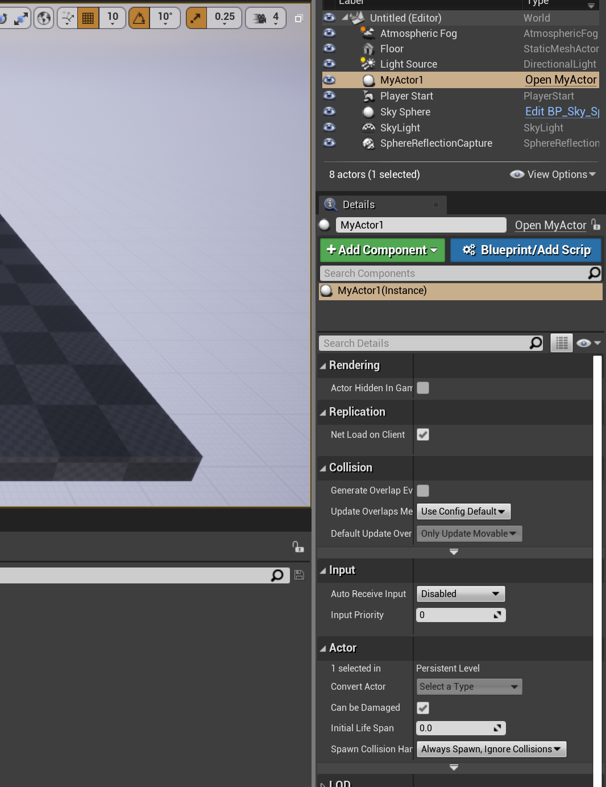
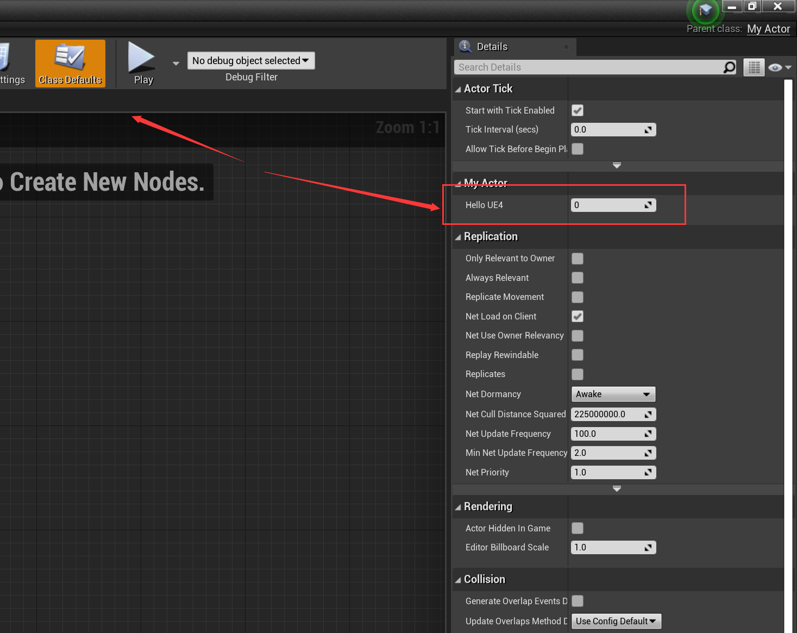
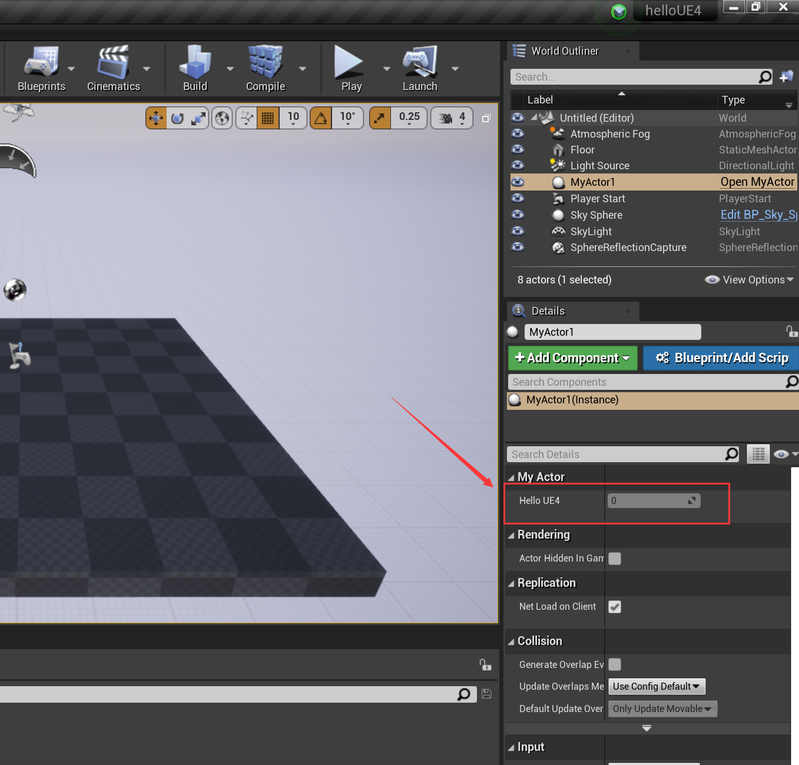
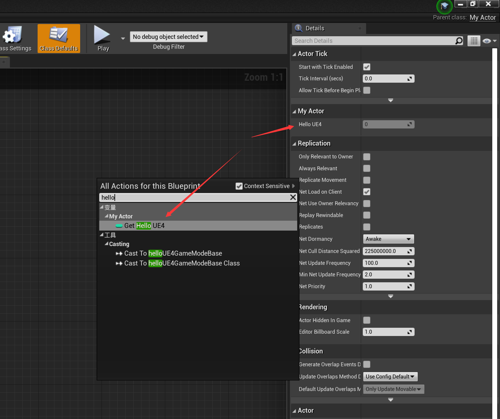
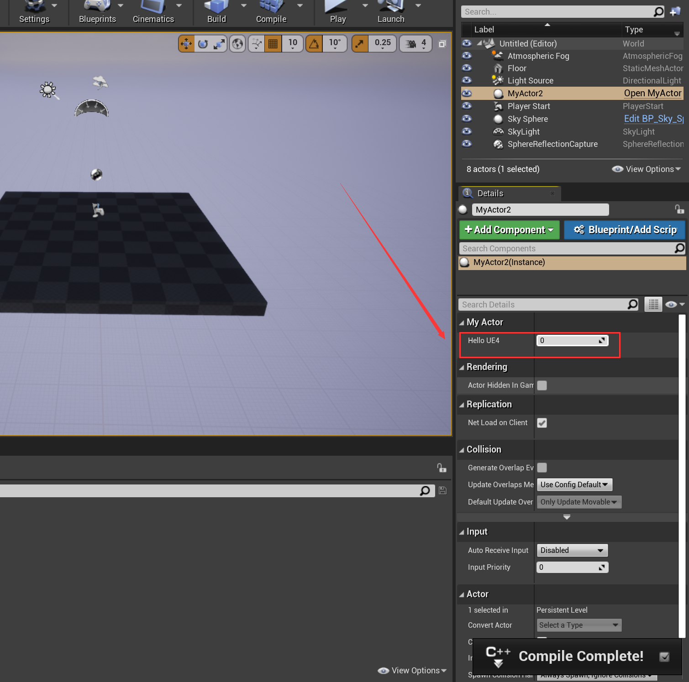

# 4. UE4常用宏：UPROPERTY和UFUNCTION

> ​	在UE4中，反射通过UHT实现，在C++引入的最后一行头文件`<文件名.generated.h>`，UHT会扫描该文件并生成对应的反射代码。`UCLASS()`和`GENERATED_BODY()`是反射宏。
>
> ​	通过上面的机制和`UPROPERTY`，就能在编辑器中看到C++中定义的变量。



## 4.0 [Unreal Engine UProperties | 虚幻引擎5.3文档](https://docs.unrealengine.com/5.3/zh-CN/unreal-engine-uproperties/)

## 4.1 UPROPERTY

​	下面是常用的属性说明符。

| 属性说明符         | 描述                                                         |
| ------------------ | ------------------------------------------------------------ |
| EditAnywhere       | 在编辑中可见，且可编辑                                       |
| EditDefaultsOnly   | 只在类默认设置中可见                                         |
| EditInstanceOnly   | 可通过属性窗口进行编辑，但只能在实例上进行，不能在原型上进行 |
| VisibleAnywhere    | 在编辑中可见，但不可编辑                                     |
| BlueprintReadOnly  | 蓝图只读                                                     |
| BlueprintReadWrite | 蓝图可读可写                                                 |

### 常用组合

​	编辑器中也就是代表了**实例**，而蓝图则是代表了**原型**。

| 组合                                | 编辑器可读 | 编辑器可写 | 蓝图可读 | 蓝图可写 |
| ----------------------------------- | ---------- | ---------- | -------- | -------- |
| EditAnywhere                        | &check;    | &check;    | &check;  | &check;  |
| EditDefaultsOnly                    |            |            | &check;  | &check;  |
| VisibleAnywhere, BlueprintReadOnly  | &check;    |            | &check;  |          |
| VisibleAnywhere, BlueprintReadWrite | &check;    |            | &check;  | &check;  |
| EditInstanceOnly                    | &check;    | &check;    |          |          |

### 示例

​	下面是一个`Actor`的例子。

```C++
// Fill out your copyright notice in the Description page of Project Settings.

#pragma once

#include "CoreMinimal.h"
#include "GameFramework/Actor.h"
#include "MyActor.generated.h"

UCLASS()
class HELLOUE4_API AMyActor : public AActor
{
	GENERATED_BODY()
	
public:	
	// Sets default values for this actor's properties
	AMyActor();
public:
	UPROPERTY(EditAnywhere)
	int32 HelloUE4;
protected:
	// Called when the game starts or when spawned
	virtual void BeginPlay() override;

public:	
	// Called every frame
	virtual void Tick(float DeltaTime) override;

};

```

#### EditAnywhere

​	在编辑器和蓝图中都可读可写。

```C++
UPROPERTY(EditAnywhere)
int32 HelloUE4;
```



#### EditDefaultsOnly

​	编辑器不可见，蓝图可读可写。



#### VisibleAnywhere和BlueprintReadOnly

​	仅编辑中可见，但不可写；蓝图可读。

```C++
UPROPERTY(VisibleAnywhere, BlueprintReadOnly)
int32 HelloUE4;
```



#### VisibleAnywhere和BlueprintReadWrite

​	仅编辑中可见，但不可写；蓝图可读可写。

```C++
UPROPERTY(VisibleAnywhere, BlueprintReadWrite)
int32 HelloUE4;
```

#### EditInstanceOnly

​	仅能改变实例的属性，即编辑器中的属性，蓝图（原型）不可见。

```C++
UPROPERTY(EditInstanceOnly)
int32 HelloUE4;
```



## 4.2 元数据说明符 - meta

​	用于修饰属性的属性。即metadata。声明类、接口、结构体、列举、列举值、函数，或属性时，可添加 **元数据说明符** 来控制其与引擎和编辑器各方面的相处方式。每一种类型的数据结构或成员都有自己的元数据说明符列表。

​	具体metadata，详见官方文档：[Unreal Engine UProperties | 虚幻引擎5.3文档](https://docs.unrealengine.com/5.3/zh-CN/unreal-engine-uproperties/)

---

#### 示例

```C++
UPROPERTY(EditInstanceOnly, meta=(ClampMin="10",ClampMax="100"))		//范围10-100
int32 HelloUE4;
```

