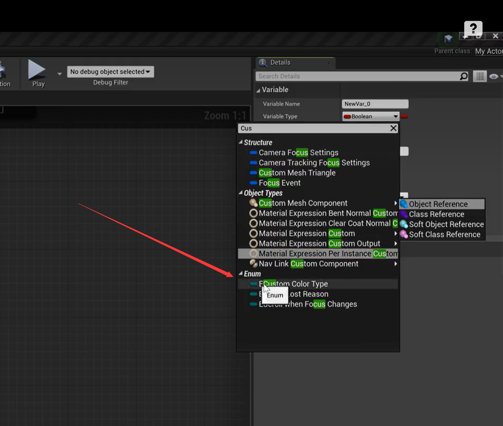
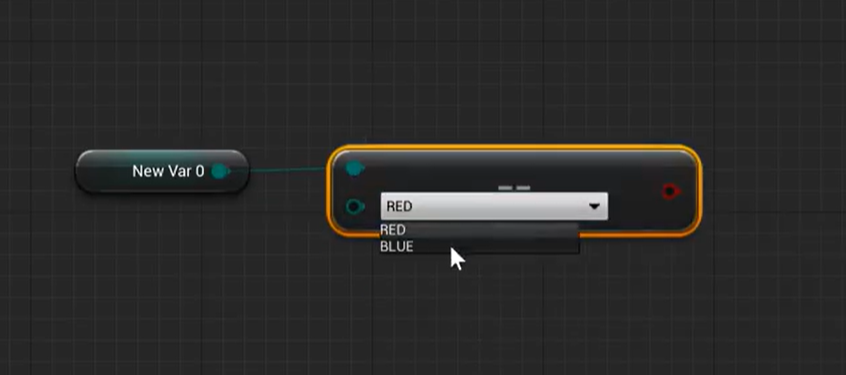

# 5. UE4枚举和结构体说明

## 1. 命名规范

| 前缀 | 说明          |
| ---- | ------------- |
| Axxx | 继承自AActor  |
| Uxxx | 继承自UObject |
| Fxxx | 原生C++类     |
| Exxx | 枚举          |
| Ixxx | 接口          |
| Sxxx | Slate         |

## 2. 枚举

### 简单示例

​	给C++使用的枚举类型，下面是**C++98的方式**，**C++11的`enum class`也可以**

```C++
UENUM()
enum ECustomColorType
{
	RED,
    BLUE,
    YELLOW,
    GREEN
};

/*
UENUM()
enum class ECustomColorType
{
	RED,
    BLUE,
    YELLOW,
    GREEN
};
*/
```

### 暴露给蓝图使用

​	使用`BlueprintType`暴露给蓝图

```C++
UENUM(BlueprintType)
enum ECustomColorType
{
	RED,
    BLUE,
    YELLOW,
    GREEN
};
```



## 3. 结构体

​	同上，不过要和类类似，加上`GENERTATED_USTRUCT_BODY`宏。

```C++
USTRUCT()	//USTRUCT(BlueprintType)
struct FTestStruct
{
	GENERTATED_USTRUCT_BODY()
    
    UPROPERTY()
    int32 hello;
};
```

