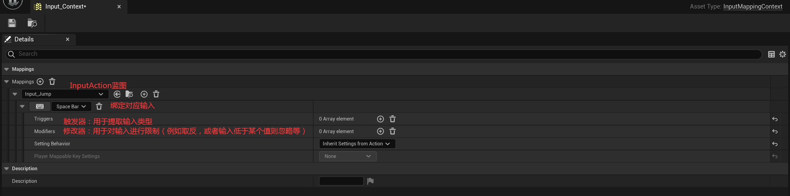
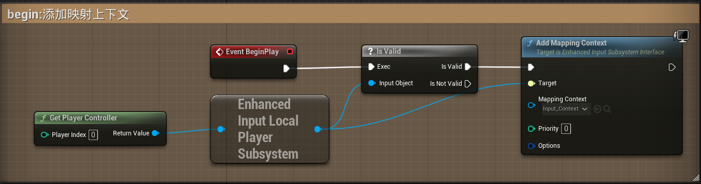
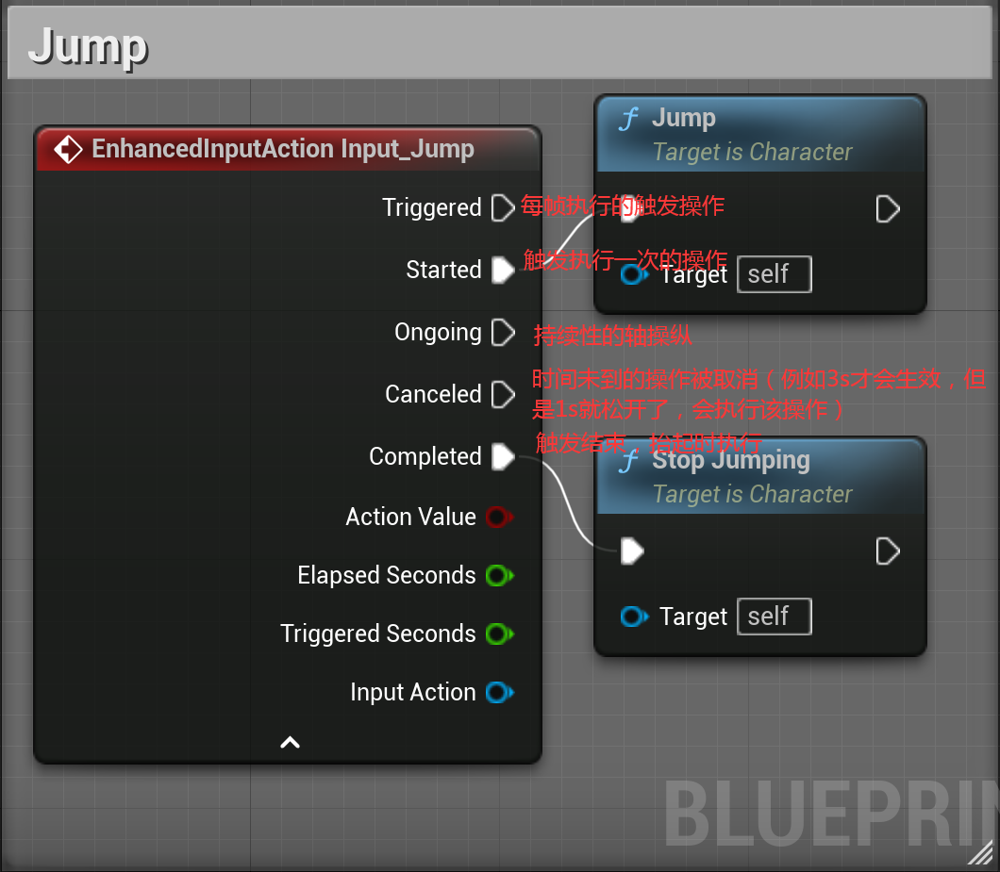

# 简介

​	增强输入系统统一了原来在项目设置偏好的输入系统，采用蓝图的方式去统一处理输入，便于复用和抽象，本质上和原输入系统一样。

​	增强输入分为两个部分：输入映射上下文和输入操作。

​	前者负责统筹后者，给后者负责对接具体的按键，当接收到具体输入时，将输入转换为后者的触发等操作。

## 输入映射上下文基础使用

​	输入映射上下文负责一套输入映射，即将某些输入映射到某些InputAction的触发上。因此只需将玩家控制器的输入映射设置为该输入映射上下文，即可启用这套输入方案。

### 绑定输入到InputAction

​	在输入映射上下文中，需要将输入与对应的InputAction蓝图绑定。例如跳跃：

### Character中启用映射上下文

​	获取玩家控制器——获取增强输入子系统——添加映射上下文（mapping input），选择映射上下文蓝图。

## 输入操作（InputAction）基本使用

​	在映射上下文中将输入与InputAction绑定，并在Character中启用该映射上下文后，其包含的所有InputAction都可以被使用了。

* OnGoing与Canceled是一致的，都是用于持续性操作中，例如蓄力。如果在蓄力中，则会进入Ongoing，如果中断了蓄力，则会进入Canceled
* Triggered，Started和Completed是用于单次触发中
  * Triggered用于每帧都会执行，获取的值为true
  * Started用于持续触发的第一次执行，获取的值为true
  * Completed用于持续触发结束，获取的值为false

