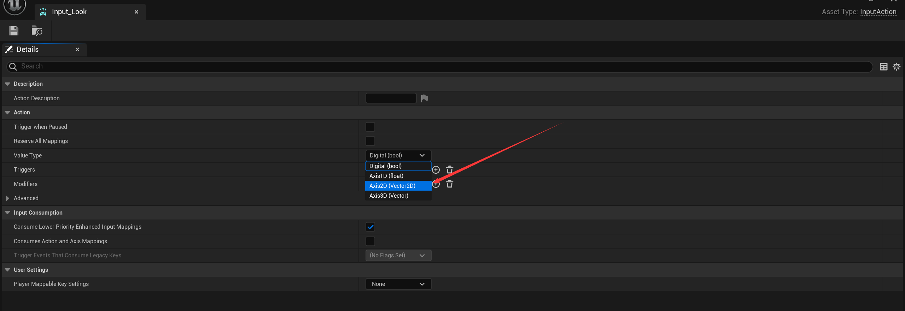
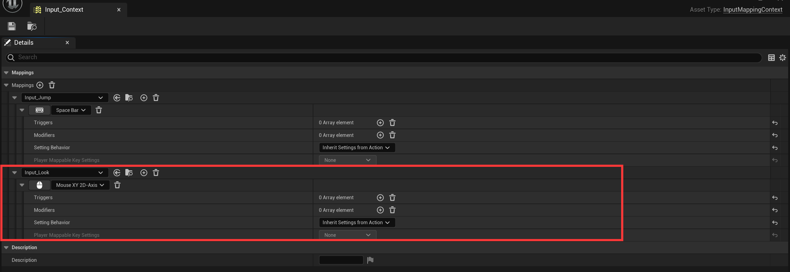
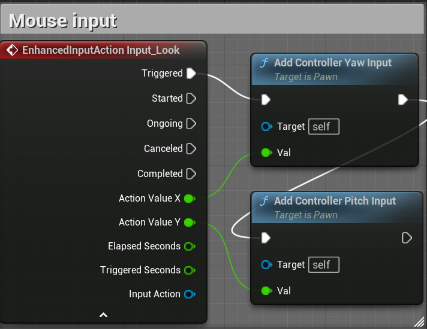
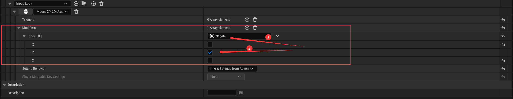

# 输入操作的二维实例（以移动视角为例）

* 创建InputAction，将值类型改为2D向量。
  * 
* 将InputAction在输入映射上下文中，与对应输入绑定
  * 
* 将对应的InputAction在Character蓝图中设置Event逻辑，与对应的动作相连接
  * 使用Trigger，因为是一个持续性的触发，也就是每一个tick触发一次
  * 将返回值分开，X给Yaw，Y给Pitch
  * 
* 测试发现Y轴是反的，需要在增强输入上下文中添加修改器，对Y轴的输入值进行取反：
  * 
  * 如果是摇杆，则还要添加一个“Dead Zone”（盲区）的修改器，用于防止过度灵敏产生的误触（限制值的下限）。