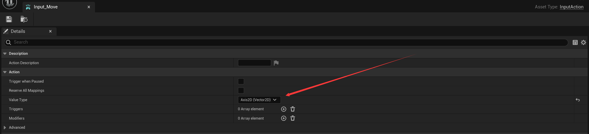

# 输入操作的二维实例（以移动角色为例）

* 创建InputAction，将值类型改为2D向量。
  * 
* 创建按键映射绑定WASD：
  * 
* 向前移动和向右移动
  * 获取角色的朝向
  * 并以此获取该朝向的平面朝向
  * 再根据平面朝向获取Forward向量和Right向量
  * 如果触发了移动输入
    * 确定对应方向的世界方向
    * 在该方向移动对应数值
  * 