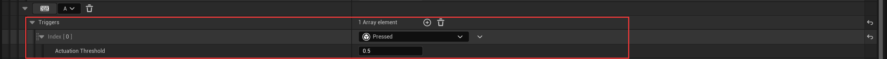

# 触发器——按下（Pressed）和松开（Released）

​	同样是针对手柄的内容。

## 按下（Pressed）

​	当按键被按下，超过阈值时，会**触发一次**。（使得该按键不能持续触发，只能在按下时被触发一次）

​	取值范围在(0,1)之间的数值，不能为0。

## 松开（Released）

​	当按键脱离阈值时，发生。

​	此时发生的顺序是

* Started
* Ongoing
* Trigger
* Completed

注意，此时Trigger在Completed前才会触发，也就是Released前触发。

