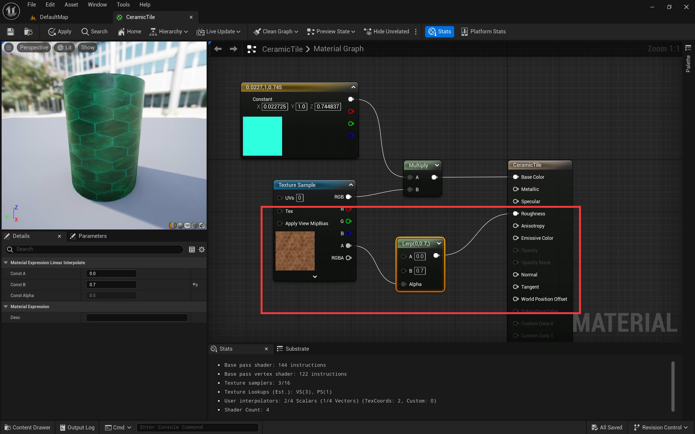

# 00 第一个材质

[TOC]

## 1. 基本介绍

### 面板说明

### 节点快捷键

* 乘法：M
* 插值：L
* 向量：数字1234

## 2. 贴图采样node

## 3. 纹理与法线

​	纹理贴图与法线是相互补充的一对信息，纹理决定了某一位置的基础颜色，而法线决定了某一位置对外部光照的反应。

### **纹理贴图**

### **法线贴图**

## 4. 颜色乘法

​	UE材质中，RGB的取值是0~1，因此可以将两个颜色进行相乘，即对应分量进行相乘。

​	相乘的结果是颜色偏向于另一个固定的颜色。

**例子**

​	下图为`陶瓷纹理的RGB值* 固定的青色`，得到偏绿的陶瓷纹理。

## 5. 插值Lerp

​	Lerp，即将输入归一化到对应的区间中。

​	例如下图是将透明度数据插值分布到0~0.7中，并填入到**粗糙度（Roughness）**属性中。

## 6. 法线输入

​	法线纹理通过TextureSample输入到Normal中。法线贴图无透明度信息，因此直接输出RGB信息即可。

## 7. 使用制作好的材质

* 将材质球直接拖拽到Actor上

  

* 或者选中Actor，在Material项上选择对应的材质

  

## 8. 重新构建新的光照

​	使用材质后，重新构建以使该材质的**光照效果生效**。

## 参考资料

* [UE4 材质入门](https://www.bilibili.com/video/BV1GJ411j7d4/?spm_id_from=333.337.search-card.all.click)

