# 01 材质输出节点简介

## 1. 混合模式（Blend mode）

​	混合模式有数个选项。

​	岩石，树木，金属物体等选择不透明。

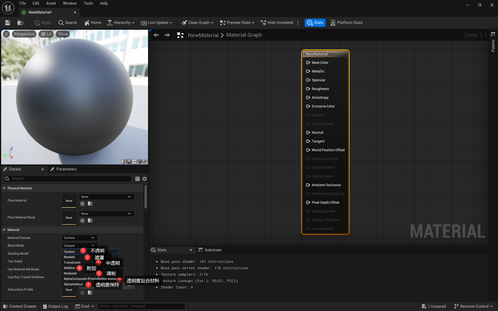

### 半透明

​	选择半透明后，光的**反射相关的选项会消失**（金属度Metallic，高光度Specular，粗糙度Roughness），即光不再发生反射。

​	取而代之的是，出现了不透明度的选项（Opacity）。

---

#### 半透明 反射

​	可以在细节中来勾选半透明的反射效果（Lighting Mode——Surface TranslucencyVolume）：

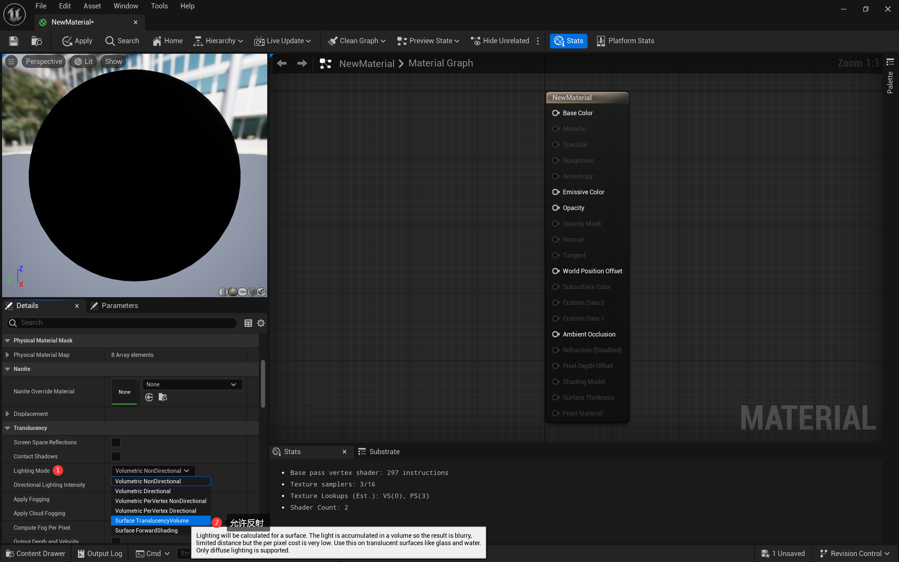

​	缺点：计算量开销很大。游戏性能极大下降。

#### 半透明 次表面（SubSurface）

​	在制作**皮肤，蜡烛，雪**等物体时，半透明需要有一定的反光，此时可以选择次表面`SubSurface`来完成。`SubSurface`是指，物体表面有一层半透明材质，光线照射进入后会发生散射，再在内部表面进行反射。

​	（Shading Mode——SubSurface）

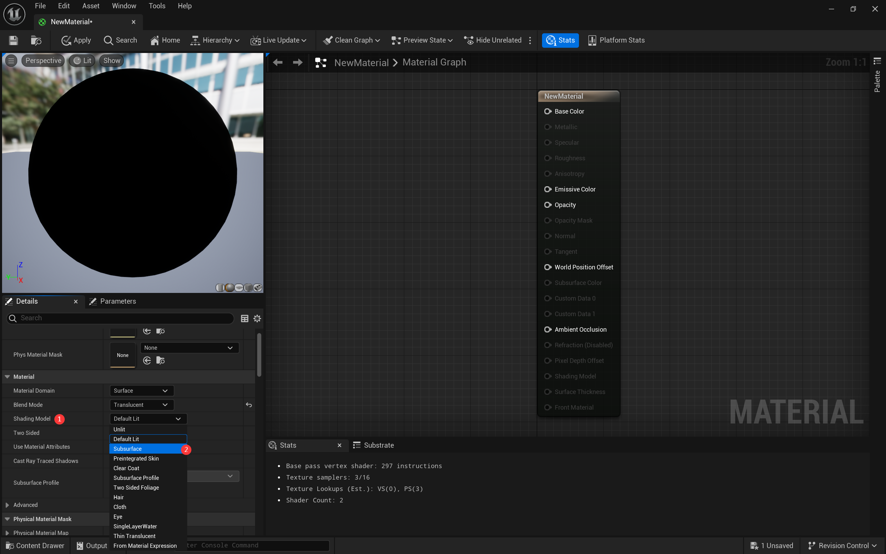

## 2. 金属度Metallic

​	越接近1，越像金属表面。

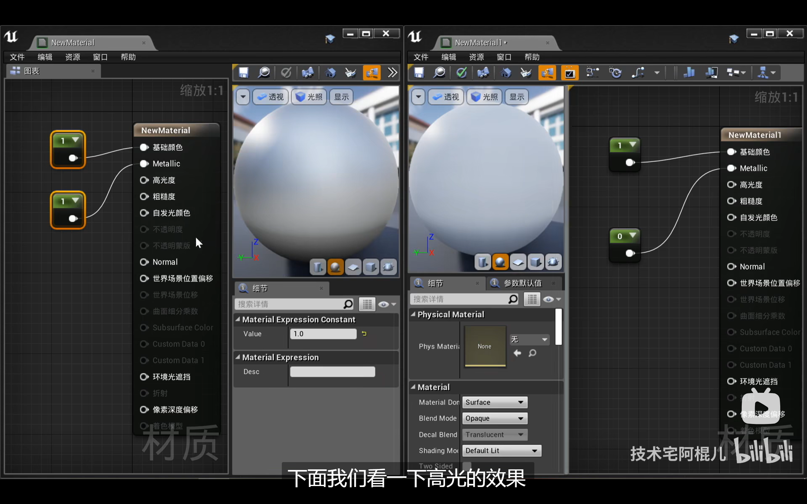

## 3. 高光度Specular

​	越接近1，高光反射效果越强和集中。

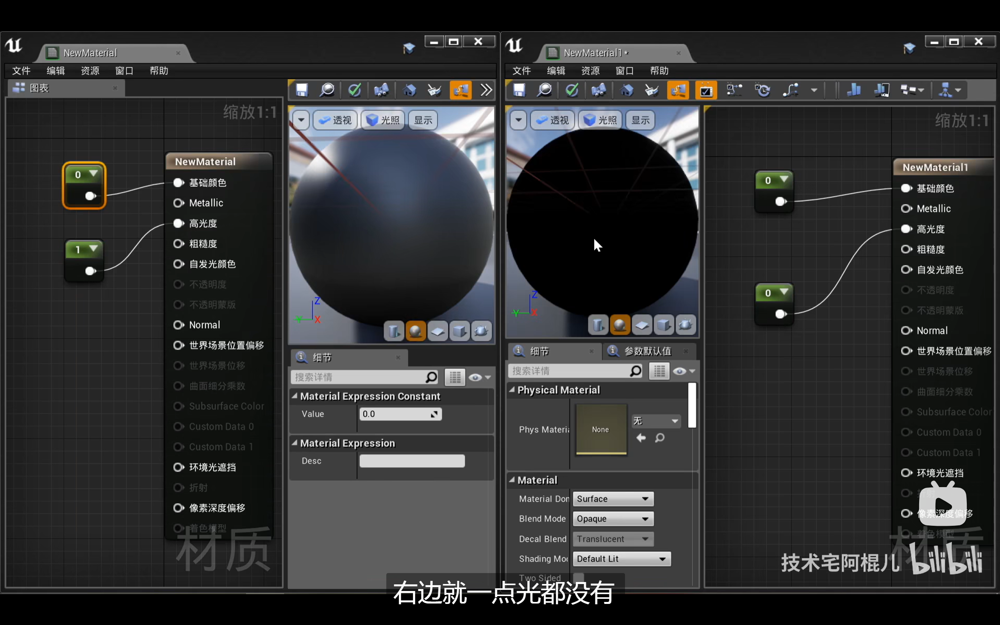

## 4. 粗糙度Roughness

​	越接近1，越粗糙（磨砂的感觉）。	表面发生**漫反射**。

​	越接近0，越光滑（镜子的感觉）。	表面发生**镜面反射**。

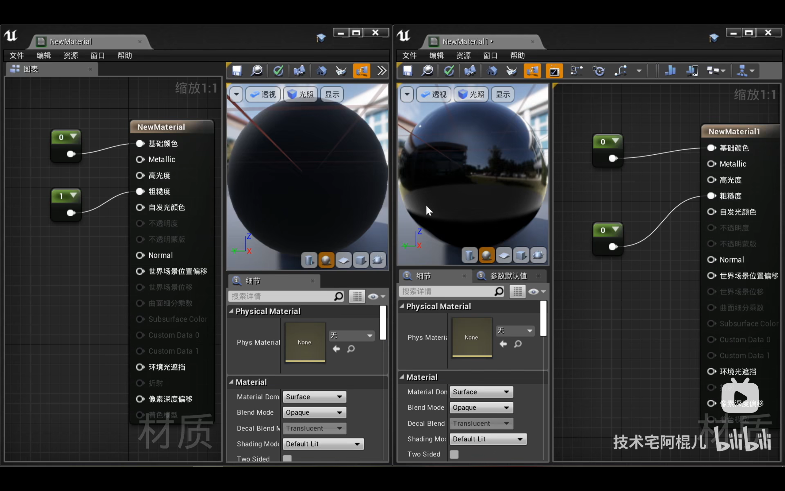

## 5. 自发光颜色Emissive Color

​	数值越大，颜色越亮。

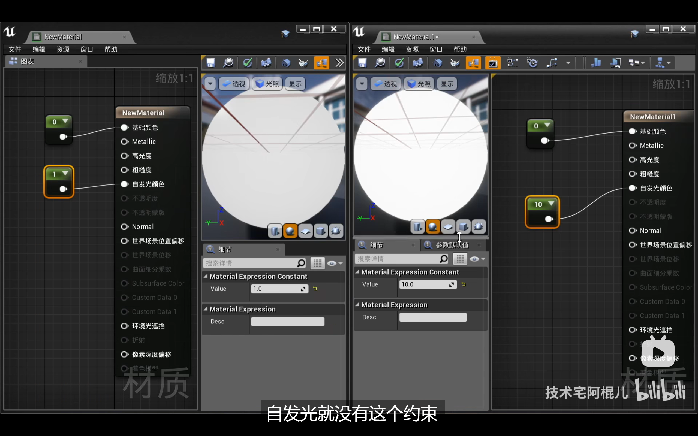

## 6. 不透明度Opacity

​	越接近1，越不透明。

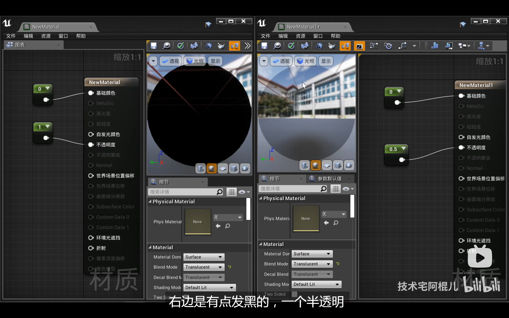

## 7. 法线Normal

​	法线可以体现出凹凸的特点。

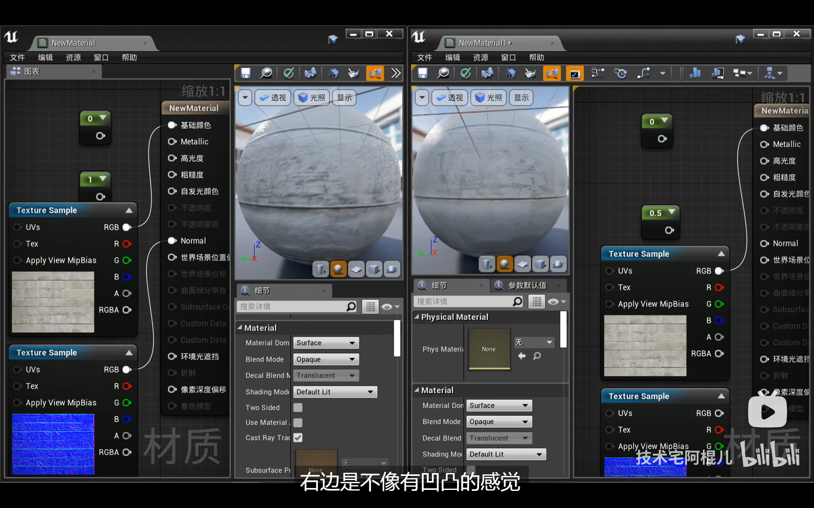

## 8. 世界场景位置偏移（World Position Offset）

​	该属性，对应了顶点，相对于原位置的偏移（输入为一个向量值，为偏移的方向和大小）。

​	下面演示了随时间变化大小的球体。（sin函数，1~10之间）。

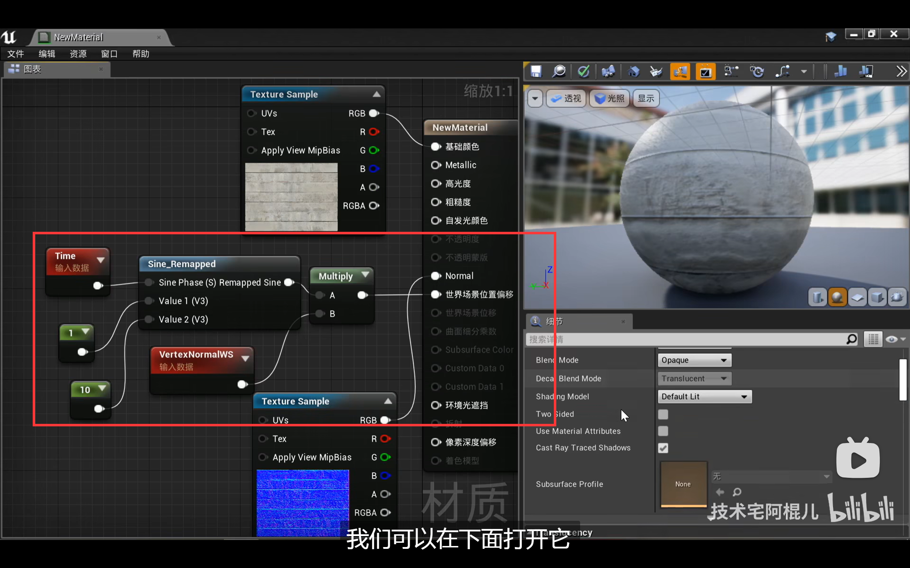

## 9. 次表面颜色（SubSurface Color）

​	构建类似于皮肤的材质。

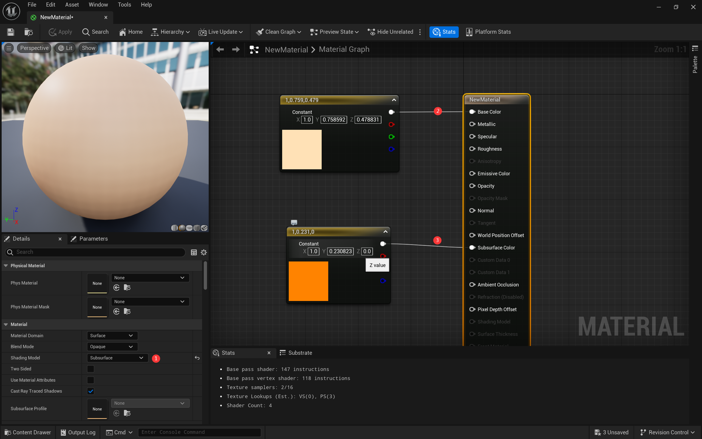

## 参考资料

* https://www.bilibili.com/video/BV1GJ411j7d4/?p=2