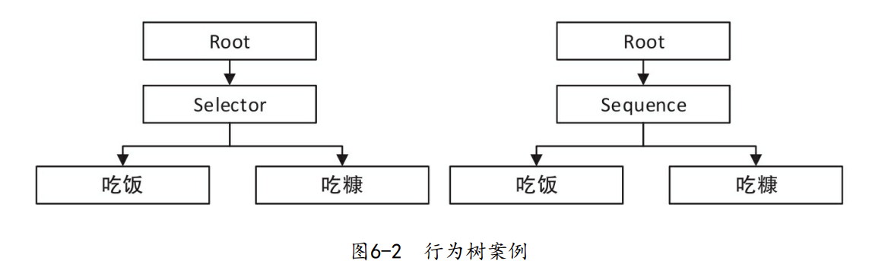
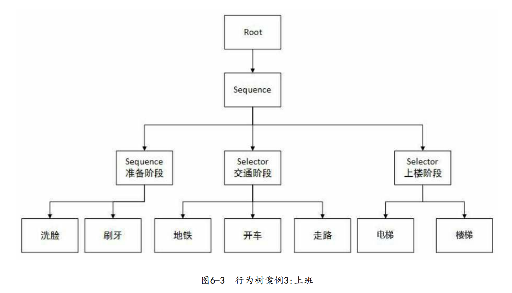

# 06.1 行为树：概念与原理

> 历史：在UE3时期，AI框架采用的是状态机来实现。在Unreal Script中还专门添加了关键字来支持AI状态机的语法。

​	UE4开始，使用行为树来替代状态机，原因在于：同样的AI模式，用状态机会涉及大量的跳转，但是用行为树就相对来说更加简化。同时由于行为树的“退行”特点，也就是“逐个尝试，不行就换”的思路，更加接近人类的思维方式。

## 1. 行为树的原理

​	“行为树”是一种通用的AI框架或者说模式，其并不依附于特定的引擎存在，并且虚幻引擎的行为树也与标准的行为树模式存在一定的差异。

### 基本节点

行为树存在下面三种节点：

* 流程控制节点
  * `Selector`选择器
  * `Sequence`顺序执行器
  * （`Parallel`平行执行暂不讨论）
* 装饰器
  * 对子树节点进行处理的节点
* 执行节点
  * 必然是**叶子节点**，执行具体的任务，并根据结果返回`true`或`false`

### 流程案例

​	对于上述两种行为树：

* 行为树左：从左向右执行，直到有一个返回true，Selector返回true，否则返回false
  * 含义：如果吃不了饭，就只能吃糠
* 行为树右：从左向右执行，只有当前返回true，才能执行下一个，直到结束返回true，中间有一个返回false则向上返回false
  * 含义：先吃饭，吃不饱继续吃糠

#### 信息归纳

**Selector版本：**

​	终止性：只要能通过吃饭把自己吃饱，绝不吃糠，表达了一种“今朝有酒今朝醉”式的享乐主义理念。换句话说，只要“吃饭”节点返回成功，今天就算过去了，直接向Root返回成功。

​	优先级：即使是Selector选择器，依然具有优先级。一旦饿了优先找饭吃，而不是找糠。先吃好的，吃饱了再说。只有当“吃饭”节点返回失败的情况下，才开始尝试优先级更低的节点。

​	只要有一个成功便是成功，全部失败才失败 只要找到一点能吃的东西， 吃饱了都算数。只有饭也没有，糠也没了，什么吃的都找不到了，才向Root汇报失败——没办法，真的没东西吃了。

**Sequence版本：**

​	顺序性：这可能是一家精打细算的主人，即使有饭吃，也得一边吃点饭， 一边吃糠。这是为了细水长流，以后每天都有点饭吃。也就是说，当“吃饭”返回成功的时候，需要继续执行接下来的节点。

​	任何一个步骤失败都失败，全部步骤做完才成功 当一点饭都没有的时候，主人家陷入了绝望的境地，也不去尝试吃糠了，直接向Root节点汇报“没办法了，真的失败了”。

### 综合案例

​	行为树对行为进行分析的关键在于，一定要从宏观到微观。先切分大的步骤，再逐步细化。以上班为例： 上班主要分为三个步骤：准备阶段，交通阶段，上楼阶段。

这个AI会按照这样的方式执行： 

1. 首先进入准备阶段：
   1. 刷牙。 
   2. 洗脸。
2.  准备阶段完成，开始准备去上班： 
   1. 看看地铁能不能坐：
      1. 走到地铁站，发现地铁因为修理被关闭。
      2. 返回false（回到家中）。
   2. 选择开车方案： 
      1. 开车出门。
      2. 返回true，顺利到达上班地点。 
3. 交通阶段完成，开始上楼：
   1. 尝试电梯，发现电梯坏掉了，返回false。
   2. 尝试走楼梯，终于到达了办公室。