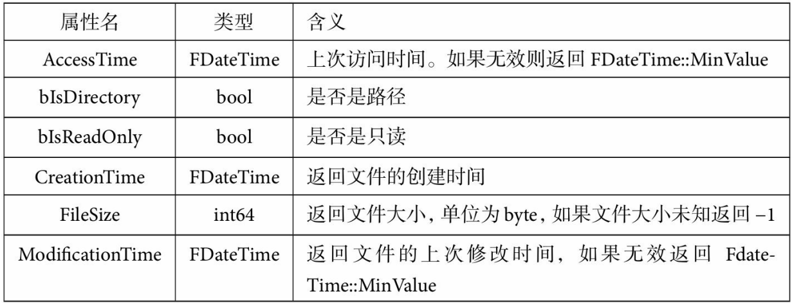

# 文件读写与访问

​	`FPlatformFileManager`定义在`Core\Public\HAL\PlatformFileManager.h`中，通过该对象的全局单例（`Get()`），获取到``类型的引用，这个对象提供当前平台的通用文件访问接口。

```C++
auto& ifile = FPlatformFileManager::Get()->GetPlatformFile();
```

​	这个接口类型，定义于`Core\Public\GenericPlatform\GenericPlatformFile.h`中。

## IPlatformFile常用函数表

| 操作                                                         | 函数                            | 备注                                                         |
| ------------------------------------------------------------ | ------------------------------- | ------------------------------------------------------------ |
| 拷贝函数                                                     | /                               | 提供文件目录和文件的拷贝操作                                 |
| 递归拷贝某个目录                                             | CopyDirectoryTree               |                                                              |
| 拷贝当前文件                                                 | CopyFile                        |                                                              |
|                                                              |                                 |                                                              |
| 创建函数                                                     | /                               | 提供创建文件和目录的操作，目录创建成功或者目录已经存在 都会返回真 |
| 创建目录                                                     | CreateDirectory                 |                                                              |
| 创建一个目录树，即给定一个路径字符串，如果对应路径的父目录不存在，也会被创建出来。 | CreateDirectoryTree             |                                                              |
|                                                              |                                 |                                                              |
| 删除函数                                                     | /                               | 删除指定目录或文件，成功删除返回真，否则失败                 |
| 删除指定目录                                                 | DeleteDirectory                 |                                                              |
| 递归删除指定目录                                             | DeleteDirectoryRecursively      |                                                              |
| 删除指定文件                                                 | DeleteFile                      |                                                              |
|                                                              |                                 |                                                              |
| 移动函数                                                     | /                               |                                                              |
| 移动指定文件                                                 | MoveFile                        |                                                              |
|                                                              |                                 |                                                              |
| 属性函数                                                     | /                               | 提供对文件、目录的属性访问操作                               |
| 检查目录是否存在                                             | DirectoryExists                 |                                                              |
| 检查文件是否存在                                             | FileExists                      |                                                              |
| 获得文件状态信息，返回FFileStatData类型对象。<br />该对象包含了所有的信息，可以通过备注的接口来快捷获取它们。 | GetStateData                    |  |
| 获得当前文件上一次访问的时间                                 | GetAccessTimeStamp              |                                                              |
| 设置文件的修改时间                                           | SetTimeStamp                    |                                                              |
| 获得文件大小，如果文件不存在返回-1                           | FileSize                        |                                                              |
| 文件是否只读                                                 | IsReadOnly                      |                                                              |
|                                                              |                                 |                                                              |
| 遍历函数                                                     | /                               | 该类函数都需要传入一个`FDirectoryVisitor`或 `FDirectoryStatVisitor`对象作为参数。<br />你可以创造一个类继承自该类，然后重写`Visit`函数。每当遍历到一个文件或者目录时，遍历函数会调用`Visitor`对象的`Visit`函数以通知执行自定义的逻辑 |
| 遍历某个目录                                                 | IterateDirectory                |                                                              |
| 递归遍历某个目录                                             | IterateDirectoryRecursively     |                                                              |
| 遍历文件目录状态，Visit函数参数为状态对象而非路径字符串；    | IterateDirectoryStat            |                                                              |
| 同上，递归遍历                                               | IterateDirectoryStatRecursively |                                                              |
|                                                              |                                 |                                                              |
| 读写函数                                                     | /                               | 最底层的读写函数往往返回IFileHandle类型的句柄，这个句 柄提供了直接读写二进制的功能。如果非绝对必要，可以考虑更高层的API,下文有讲述 |
| 打开一个文件用于读取，返回IFileHandle类型的句柄用于读取      | OpenRead                        |                                                              |
| 打开一个文件用于写入，返回IFileHandle类型的句柄              | OpenWrite                       |                                                              |

## FFileHelper常用函数表

​	针对一些极其普遍的需求，虚幻引擎提供了一套更简单的方式用于读写文件内容，即`FFileHelper`类，位于`CoreMisc`头文件中，提供以下静态函数

| 操作                                                         | 函数名                    |
| ------------------------------------------------------------ | ------------------------- |
| 直接将路径指定的文件读取到一个TArray类型的二进制数组中       | LoadFileToArray           |
| 直接将路径指定的文本文件读取到一个FString类型的字符串中。请注意，字符串有长度限制，不要试图读取超大文本文件 | LoadFileToString          |
| 保存一个二进制数组到文件中                                   | SaveArrayToFile           |
| 保存一个字符串到指定文件中                                   | SaveStringToFile          |
| 在硬盘中创建一个BMP文件                                      | CreateBitmap              |
| 读取一个ANSI编码的文本文件到一个FString数组中，每行对应一个FString类型的对象 | LoadANSITextFileToStrings |

