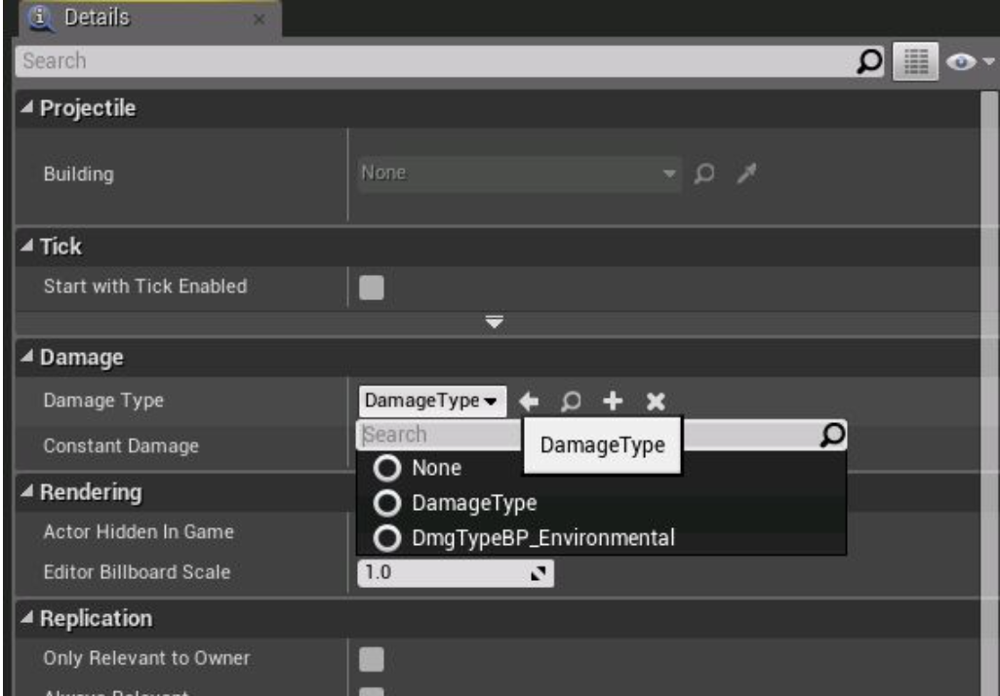

# TSubOfClass

## UPROPERTY 安全性

​	TSubOfClass是一个类型安全的模板类，用于指定分配的类型。代码与蓝图中都会进行类型检查。

```C++
/** type of damage */
UPROPERTY(EditDefaultsOnly, Category=Damage)
TSubclassOf<UDamageType> DamageType;		// 仅能分配UDamageType类型的值
```



## 运行时检查

​	如果得到的值是一个UClass的指针，它会检查是否符合要求。不符合则会返回nullptr。

```C++
UClass* ClassA = UDamageType::StaticClass();

TSubclassOf<UDamageType> ClassB;

ClassB = ClassA; // Performs a runtime check

TSubclassOf<UDamageType_Lava> ClassC;

ClassB = ClassC; // Performs a compile time check
```

