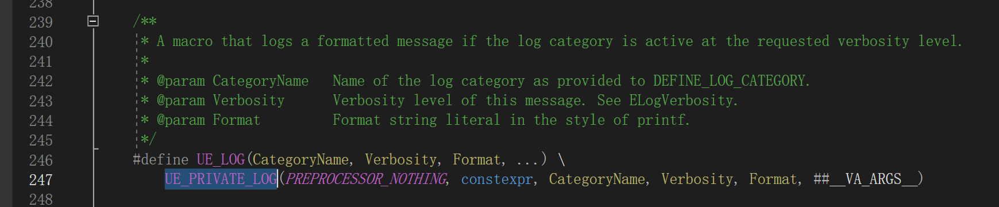
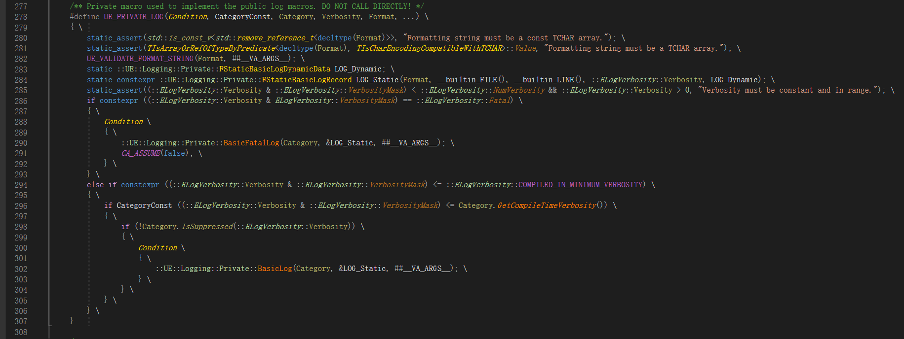
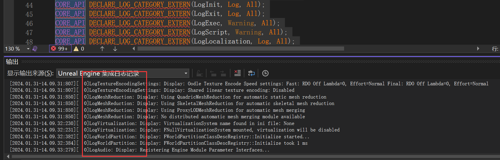

# UE_LOG使用说明

## 0 定义

​	在`UE5.3.2`版本中，`UE_LOG`定义在`\Engine\Source\Runtime\Core\Private\Logging\LogMacros.h`下，通过调用了`UE_PRIVATE_LOG`宏来实现。

```C++
#define UE_LOG(CategoryName, Verbosity, Format, ...) \
		UE_PRIVATE_LOG(PREPROCESSOR_NOTHING, constexpr, CategoryName, Verbosity, Format, ##__VA_ARGS__)
```



​	这个宏的定义如下，注释说不要直接调用它：



* [【UE4源代码观察】观察 UE_LOG-CSDN博客](https://blog.csdn.net/u013412391/article/details/105420570)

## 1 日志Category

### 原本定义

​	UE_LOG的第一个参数，用于说明该日志的分类。它的本质是定义了一个类并创建一个对象，用于传递给`UE_LOG`的第一个参数，这些分类会在`CoreGlobals.h`中定义，除了最后一个LogTemp，其它是UE自己使用的：

```C++
CORE_API DECLARE_LOG_CATEGORY_EXTERN(LogHAL, Log, All);
CORE_API DECLARE_LOG_CATEGORY_EXTERN(LogSerialization, Log, All);
CORE_API DECLARE_LOG_CATEGORY_EXTERN(LogUnrealMath, Log, All);
CORE_API DECLARE_LOG_CATEGORY_EXTERN(LogUnrealMatrix, Log, All);
CORE_API DECLARE_LOG_CATEGORY_EXTERN(LogContentComparisonCommandlet, Log, All);
CORE_API DECLARE_LOG_CATEGORY_EXTERN(LogNetPackageMap, Warning, All);
CORE_API DECLARE_LOG_CATEGORY_EXTERN(LogNetSerialization, Warning, All);
CORE_API DECLARE_LOG_CATEGORY_EXTERN(LogMemory, Log, All);
CORE_API DECLARE_LOG_CATEGORY_EXTERN(LogProfilingDebugging, Log, All);
CORE_API DECLARE_LOG_CATEGORY_EXTERN(LogCore, Log, All);
CORE_API DECLARE_LOG_CATEGORY_EXTERN(LogOutputDevice, Log, All);

CORE_API DECLARE_LOG_CATEGORY_EXTERN(LogSHA, Warning, All);
CORE_API DECLARE_LOG_CATEGORY_EXTERN(LogStats, Log, All);
CORE_API DECLARE_LOG_CATEGORY_EXTERN(LogStreaming, Display, All);
CORE_API DECLARE_LOG_CATEGORY_EXTERN(LogInit, Log, All);
CORE_API DECLARE_LOG_CATEGORY_EXTERN(LogExit, Log, All);
CORE_API DECLARE_LOG_CATEGORY_EXTERN(LogExec, Warning, All);
CORE_API DECLARE_LOG_CATEGORY_EXTERN(LogScript, Warning, All);
CORE_API DECLARE_LOG_CATEGORY_EXTERN(LogLocalization, Log, All);
CORE_API DECLARE_LOG_CATEGORY_EXTERN(LogLongPackageNames, Log, All);
CORE_API DECLARE_LOG_CATEGORY_EXTERN(LogProcess, Log, All);
CORE_API DECLARE_LOG_CATEGORY_EXTERN(LogLoad, Log, All);
CORE_API DECLARE_LOG_CATEGORY_EXTERN(LogVirtualization, Log, All);

// Temporary log category, generally you should not check things in that use this
CORE_API DECLARE_LOG_CATEGORY_EXTERN(LogTemp, Log, All);
```

​	也有一些在别的模块定义，便于这些模块打印属于自己的日志类别，可以在VS中看到这些日志类别前缀。



### 自定义Category

​	UE 提供了几种方法来创建 Log 的 Category：

```C++
DECLARE_LOG_CATEGORY_EXTERN(LogCategoryName,All,All);
DECLARE_LOG_CATEGORY_CLASS(LogCategoryName2,All,All);
DECLARE_LOG_CATEGORY_EXTERN_HELPER(LogCategoryName3,All,All);	//5.3版本中未找到该宏
```

​	UE官方文档只提供了`DECLARE_LOG_CATEGORY_EXTERN`的宏方法来创建，因此主要以`DECLARE_LOG_CATEGORY_EXTERN`为例，分为3步。

* 头文件声明
* cpp文件定义
* 使用

---

#### h文件

​	在头文件的include下声明：

>A macro to declare a logging category as a C++ "extern", usually declared in the header and paired with DEFINE_LOG_CATEGORY in the source. Accessible by all files that include the header.

```C++
DECLARE_LOG_CATEGORY_EXTERN(<LOG_CATEGORY>, <VERBOSITY_LEVEL>, All);
```

​	第一个参数是自定义的日志Category字符串。第二和第三个参数是`ELogVerbosity`的枚举值，用于指定运行时和编译时的日志等级（如下代码所示）。

```C++
/** 
 * Enum that defines the verbosity levels of the logging system.
 * Also defines some non-verbosity levels that are hacks that allow
 * breaking on a given log line or setting the color.
**/
namespace ELogVerbosity
{
	enum Type : uint8
	{
		/** Not used */
		NoLogging		= 0,

		/** Always prints a fatal error to console (and log file) and crashes (even if logging is disabled) */
		Fatal,

		/** 
		 * Prints an error to console (and log file). 
		 * Commandlets and the editor collect and report errors. Error messages result in commandlet failure.
		 */
		Error,

		/** 
		 * Prints a warning to console (and log file).
		 * Commandlets and the editor collect and report warnings. Warnings can be treated as an error.
		 */
		Warning,

		/** Prints a message to console (and log file) */
		Display,

		/** Prints a message to a log file (does not print to console) */
		Log,

		/** 
		 * Prints a verbose message to a log file (if Verbose logging is enabled for the given category, 
		 * usually used for detailed logging) 
		 */
		Verbose,

		/** 
		 * Prints a verbose message to a log file (if VeryVerbose logging is enabled, 
		 * usually used for detailed logging that would otherwise spam output) 
		 */
		VeryVerbose,

		// Log masks and special Enum values

		All				= VeryVerbose,
		NumVerbosity,
		VerbosityMask	= 0xf,
		SetColor		= 0x40, // not actually a verbosity, used to set the color of an output device 
		BreakOnLog		= 0x80
	};
}
```

​	注意：这个宏的展开是继承自 `FLogCategory` 的一个类定义，并且 **声明** 了一个 `LogCategoryName` 的对象，但是它并未定义一个对象：

```C++
DECLARE_LOG_CATEGORY_EXTERN(TestLog, Fatal, All);

// 展开
extern struct FLogCategoryTestLog : public FLogCategory<ELogVerbosity::Fatal, ELogVerbosity::All> {
	__forceinline FLogCategoryTestLog() : FLogCategory(L"TestLog") {}
} TestLog;;
```

#### cpp文件

​	在头文件创建了新的LOG类别声明后，在cpp文件的include下面使用下面的宏定义：

```C++
DEFINE_LOG_CATEGORY(<LOG_CATEGORY>);
```

​	这个用于定义一个该class的一个对象：

```C++
DEFINE_LOG_CATEGORY(TestLog);

// 展开
FLogCategoryTestLog TestLog;
```

#### 使用

​	接下来就可以使用自定义的UE_LOG的Category了。

```C++
UE_LOG(TestLog, Warning, TEXT("Test"));
```

#### 拓展：DECLARE_LOG_CATEGORY_CLASS

​	这个宏主要用作cpp文件中，代替`DECLARE_LOG_CATEGORY_EXTERN`和`DEFINE_LOG_CATEGORY`。

```C++
static struct FLogCategoryTestLog : public FLogCategory<ELogVerbosity::Fatal, ELogVerbosity::All> {
	__forceinline FLogCategoryTestLog() : FLogCategory(L"TestLog") {}
} TestLog;;
```

区别在于：

1. 去掉了 `extern` 修饰符
2. 增加了 static 修饰符，定义对象

​	因此，使用这个宏的用途一般直接写在.cpp 文件中，只供当前的翻译单元使用。

* [UE 中 Log 实现代码分析 | 虚幻社区知识库 (ue5wiki.com)](https://ue5wiki.com/wiki/39534/)

## 2 日志详细级别Verbosity

​	UE_LOG的第二个参数就是上述的枚举类型`ELogVerbosity`，不再赘述。

## 3 Format

​	对于能传入的变量类型，有下表：

| 变量类型  | 符号 | 案例                                                         |
| --------- | ---- | ------------------------------------------------------------ |
| `Fstring` | `%s` | `UE_LOG(LogTemp, Warning, TEXT("An Actor's name is %s"), *ExampleActor->GetName());` |
| `bool`    | `%s` | `UE_LOG(LogTemp, Warning, TEXT("The boolean value is %s"), ( bExampleBool ? TEXT("true"): TEXT("false") )` |
| `int`     | `%d` | `UE_LOG(LogTemp, Warning, TEXT("The integer value is: %d"), ExampleInteger);` |
| `float`   | `%f` | `UE_LOG(LogTemp, Warning, TEXT("The float value is: %f"), ExampleFloat);` |
| `Fvector` | `%s` | `UE_LOG(LogTemp, Warning, TEXT("The vector value is: %s"), *ExampleVector.ToString());` |
| ...       | ...  | `UE_LOG(LogTemp, Warning, TEXT("Current values are: vector %s, float %f, and integer %d"), *ExampleVector.ToString(), ExampleFloat, ExampleInteger);` |

[虚幻引擎中的日志记录 | 虚幻引擎5.3文档 (unrealengine.com)](https://docs.unrealengine.com/5.3/zh-CN/logging-in-unreal-engine/)