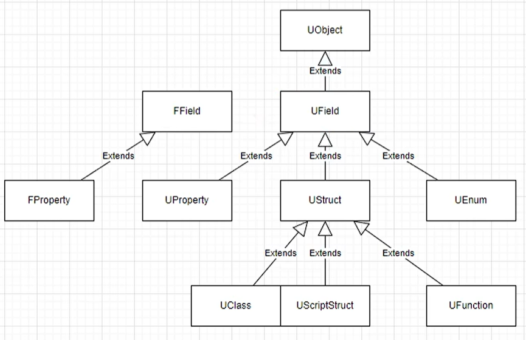

# UE类型系统

​	UE的类型系统是指在运行时能动态获取到Object的类型信息的系统。它是从`UField`开始继承，而非UObject。继承自UObject的原因在于，UObject提供了序列化的重要功能，便于使用。

## 类型标记

​	通过在对应声明上标记UCLASS，UPROPERTY等，就会创建一个对应的类型类，里面存储对应的类型信息。

* [[UE5 C++] UE类型反射数据基础——UStruct/UClass](https://www.bilibili.com/video/BV1Fp4y1K7zK/?spm_id_from=333.337.search-card.all.click)

