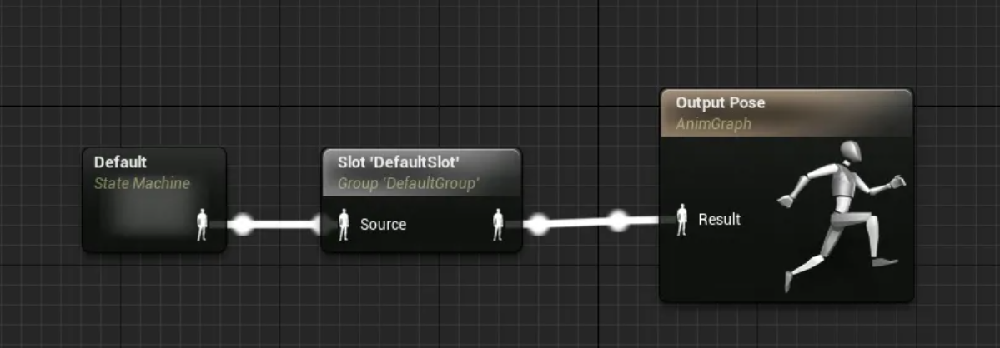
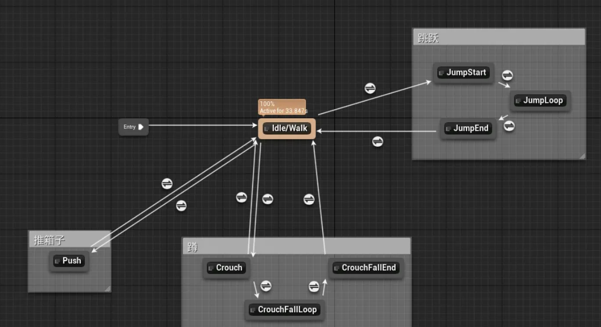

# 动画与蒙太奇

​	动画蓝图是由状态机和插槽驱动的，以一种线性的方式输出。一般插槽用于插入蒙太奇蓝图，用于限制动画播放的优先级。

​	如上图，如果Default Slot在Default的状态机后，则垄断了所有状态机的动画，即该蒙太奇动画不能被打断。

## 动画状态机

​	动画状态机由状态和状态转移函数来确定：

## 使用蒙太奇的原因

* 随着状态机功能的增加，它的状态网络也会越来越复杂，修改的时候容易牵一发而动全身，因此它的设计、维护以及扩展都是比较困难的。
* 我们还会遇到这样的情况：有些动画，它们数量很多，但每个动画可能仅在特殊的场合触发那么一两次（比如：角色遇到了特殊的机关要操作一下），把这些动画都放在状态机中不但工作量巨大，而且性价比很低。
* 还有些时候，我们想跳出状态机的控制，从而获得角色动画的直接控制权，用代码直接调用动画。

## 蒙太奇的使用方法

[虚幻引擎图文笔记：蒙太奇（Montage）+ 根运动（Root Motion），给我滚（Roll）！ - 知乎 (zhihu.com)](https://zhuanlan.zhihu.com/p/346691425)

## 参考资料

* [虚幻引擎图文笔记：什么是蒙太奇（Montage）之 概念和原理 - 知乎 (zhihu.com)](https://zhuanlan.zhihu.com/p/346332068)
* [虚幻引擎图文笔记：蒙太奇（Montage）+ 根运动（Root Motion），给我滚（Roll）！ - 知乎 (zhihu.com)](https://zhuanlan.zhihu.com/p/346691425)

