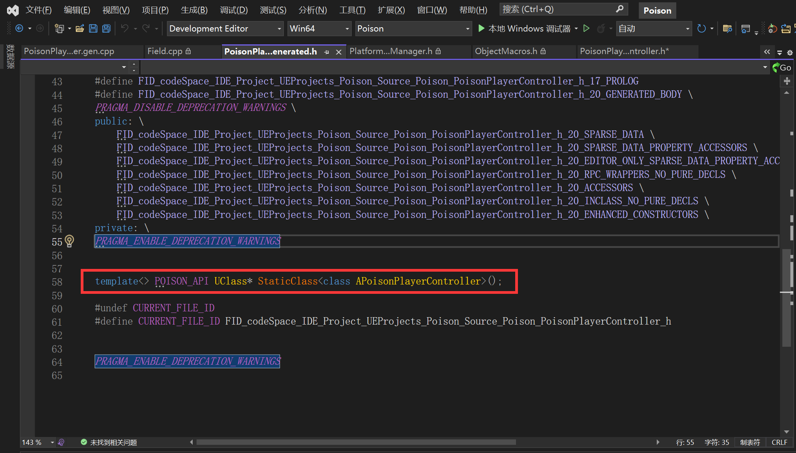
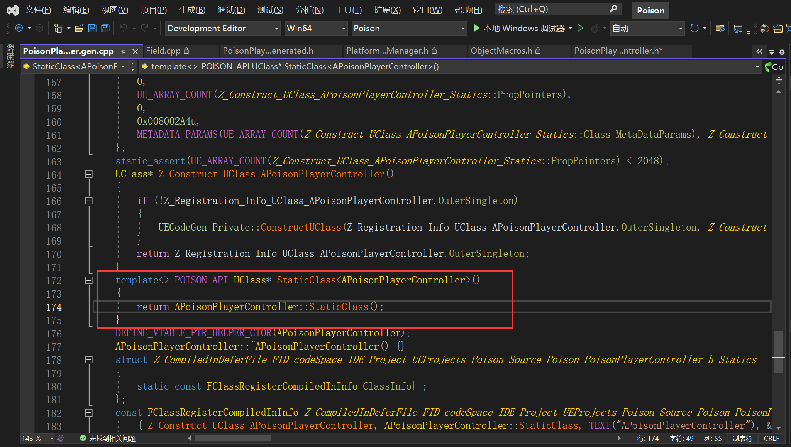

# 浅析StaticClass的实现

​	每一个继承自UObject的类，都可以通过`xxx::StaticClass()`获取到该类的UClass对象。本文主要研究该函数在何处定义以及实现方式。

## 声明点和定义点

​	在`xxx.generated.h`中，通过模板特化，出现了该函数的声明：



### 模板特化StaticClass的定义

​	在`xxx.generated.cpp`中，可以找到该函数的定义，是转发调用了`xxx::StaticClass()`静态成员函数。



### 静态成员函数StaticClass的定义

​	仔细查看后发现，这个被转发的成员函数，是从`GENERATE_BODY`宏中的`DECLARE_CLASS`宏创建的定义，这个宏被定义于`CoreUObject\Public\UObject\ObjectMacros.h`中。

```C++
#define DECLARE_CLASS( TClass, TSuperClass, TStaticFlags, TStaticCastFlags, TPackage, TRequiredAPI  ) \
private: \
    TClass& operator=(TClass&&);   \
    TClass& operator=(const TClass&);   \
	TRequiredAPI static UClass* GetPrivateStaticClass(); \
public: \
	/** Bitwise union of #EClassFlags pertaining to this class.*/ \
	static constexpr EClassFlags StaticClassFlags=EClassFlags(TStaticFlags); \
	/** Typedef for the base class ({{ typedef-type }}) */ \
	typedef TSuperClass Super;\
	/** Typedef for {{ typedef-type }}. */ \
	typedef TClass ThisClass;\
	/** Returns a UClass object representing this class at runtime */ \
	inline static UClass* StaticClass() \
	{ \
		return GetPrivateStaticClass(); \
	} \
	/** Returns the package this class belongs in */ \
	inline static const TCHAR* StaticPackage() \
	{ \
		return TPackage; \
	} \
	/** Returns the static cast flags for this class */ \
	inline static EClassCastFlags StaticClassCastFlags() \
	{ \
		return TStaticCastFlags; \
	} \
	/** For internal use only; use StaticConstructObject() to create new objects. */ \
	inline void* operator new(const size_t InSize, EInternal InInternalOnly, UObject* InOuter = (UObject*)GetTransientPackage(), FName InName = NAME_None, EObjectFlags InSetFlags = RF_NoFlags) \
	{ \
		return StaticAllocateObject(StaticClass(), InOuter, InName, InSetFlags); \
	} \
	/** For internal use only; use StaticConstructObject() to create new objects. */ \
	inline void* operator new( const size_t InSize, EInternal* InMem ) \
	{ \
		return (void*)InMem; \
	} \
	/* Eliminate V1062 warning from PVS-Studio while keeping MSVC and Clang happy. */ \
	inline void operator delete(void* InMem) \
	{ \
		::operator delete(InMem); \
	}
```

​	可以看到，这个宏中定义了`StaticClass()`成员函数，方法是转发`GetPrivateStaticClass()`成员函数。

### 成员函数GetPrivateStaticClass的定义

​	`GetPrivateStaticClass`成员函数是在`xxx.genereated.cpp`中的宏`IMPLEMENT_CLASS_NO_AUTO_REGISTRATION`定义的。这个宏本身定义于`CoreUObject\Public\UObject\ObjectMacros.h`中。可以看出它是一个经典的单例模式：

```C++
#define IMPLEMENT_CLASS_NO_AUTO_REGISTRATION(TClass) \
	FClassRegistrationInfo Z_Registration_Info_UClass_##TClass; \
	UClass* TClass::GetPrivateStaticClass() \
	{ \
		if (!Z_Registration_Info_UClass_##TClass.InnerSingleton) \
		{ \
			/* this could be handled with templates, but we want it external to avoid code bloat */ \
			GetPrivateStaticClassBody( \
				StaticPackage(), \
				(TCHAR*)TEXT(#TClass) + 1 + ((StaticClassFlags & CLASS_Deprecated) ? 11 : 0), \
				Z_Registration_Info_UClass_##TClass.InnerSingleton, \
				StaticRegisterNatives##TClass, \
				sizeof(TClass), \
				alignof(TClass), \
				TClass::StaticClassFlags, \
				TClass::StaticClassCastFlags(), \
				TClass::StaticConfigName(), \
				(UClass::ClassConstructorType)InternalConstructor<TClass>, \
				(UClass::ClassVTableHelperCtorCallerType)InternalVTableHelperCtorCaller<TClass>, \
				UOBJECT_CPPCLASS_STATICFUNCTIONS_FORCLASS(TClass), \
				&TClass::Super::StaticClass, \
				&TClass::WithinClass::StaticClass \
			); \
		} \
		return Z_Registration_Info_UClass_##TClass.InnerSingleton; \
	}
```

## GetPrivateStaticClassBody函数解读

​	这个函数定义于`CoreUObject\Private\UObject\Class.cpp`中，原型为：

```C++
void GetPrivateStaticClassBody(
	const TCHAR* PackageName,
	const TCHAR* Name,
	UClass*& ReturnClass,
	void(*RegisterNativeFunc)(),
	uint32 InSize,
	uint32 InAlignment,
	EClassFlags InClassFlags,
	EClassCastFlags InClassCastFlags,
	const TCHAR* InConfigName,
	UClass::ClassConstructorType InClassConstructor,
	UClass::ClassVTableHelperCtorCallerType InClassVTableHelperCtorCaller,
	FUObjectCppClassStaticFunctions&& InCppClassStaticFunctions,
	UClass::StaticClassFunctionType InSuperClassFn,
	UClass::StaticClassFunctionType InWithinClassFn
	);
```

### 函数指针解读

​	在函数中，出现了两个函数指针：

```C++
(UClass::ClassConstructorType)InternalConstructor<TClass>;
(UClass::ClassVTableHelperCtorCallerType)InternalVTableHelperCtorCaller<TClass>;
```

​	它们是对模板类进行特化实现后，将特化的函数指针传递过来：

```C++
/**
 * Helper template to call the default constructor for a class
 */
template<class T>
void InternalConstructor( const FObjectInitializer& X )
{ 
	T::__DefaultConstructor(X);
}

/**
 * Helper template to call the vtable ctor caller for a class
 */
template<class T>
UObject* InternalVTableHelperCtorCaller(FVTableHelper& Helper)
{
	return T::__VTableCtorCaller(Helper);
}
```


* [StaticClass 实现分析 | 虚幻社区知识库 (ue5wiki.com)](https://ue5wiki.com/wiki/40612/)