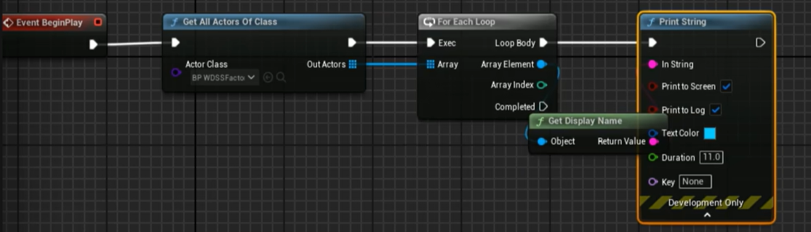
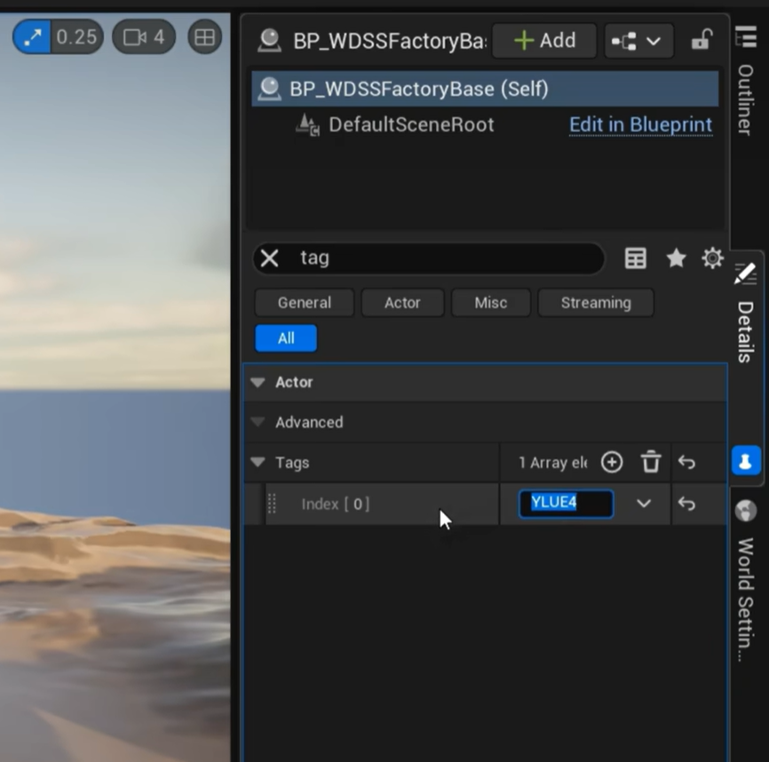
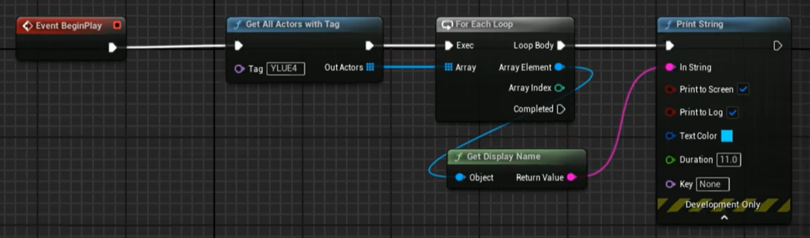
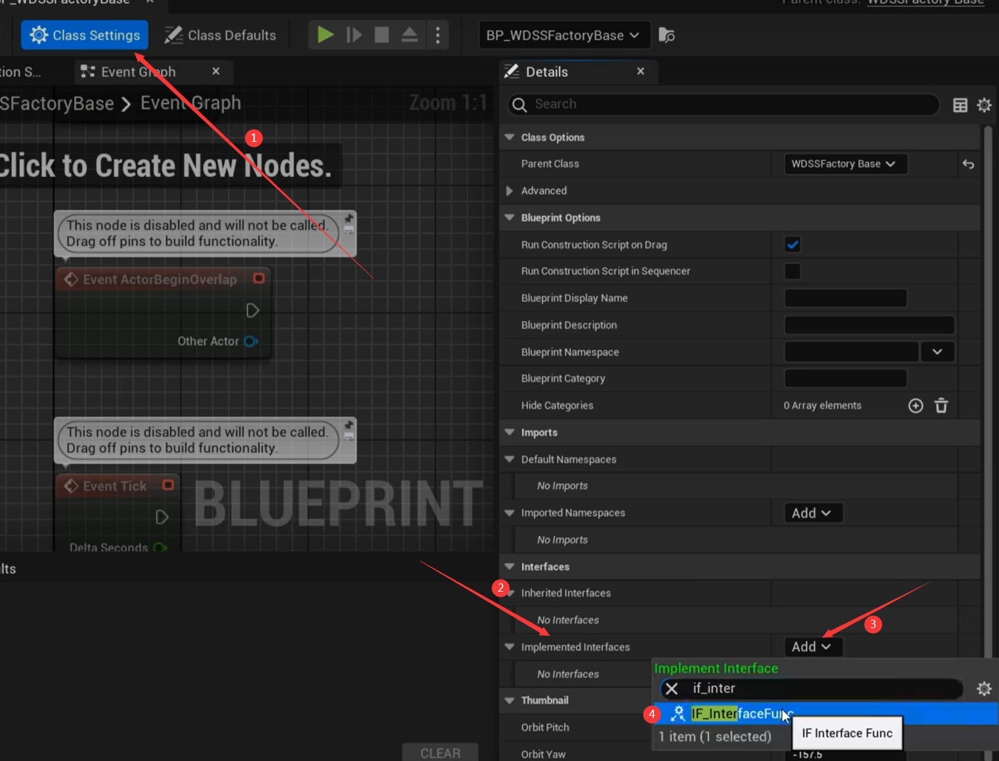
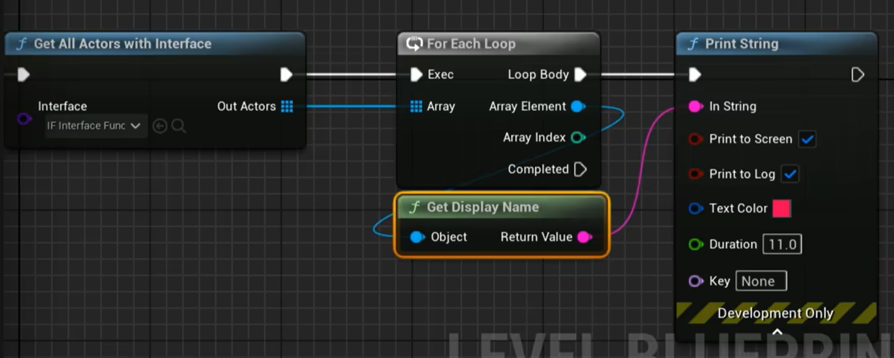

# 蓝图通信（11种方法）

[TOC]

## 1. Get All Actors Of Class

​	介绍：略

​	优点为简单易做，缺点是性能开销较大，不建议放在帧调用环节。推荐在Event Begin中保存对应的数组，在后续调用。

## 2. Get All Actors Of Tags

​	介绍：在Actor的实例中可以设置Tag，通过场景中Actor的Tag来寻找对应的实例。

## 3. Get All Actors With Interface

​	介绍：获取所有包含该Interface的Actor类实例。

​	步骤：

* 创建一个Interface类

* 在Actor中添加Interface接口（可以选择实现Interface中的函数）

* 通过`Get All Actors With Interface`找到对应实例

  

## 4. 