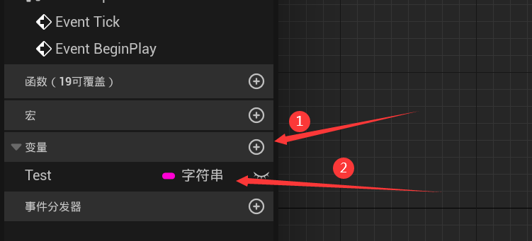
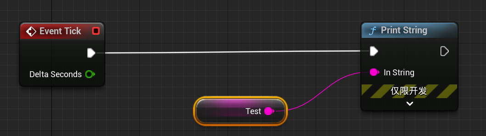
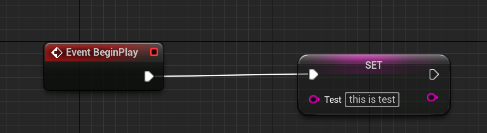
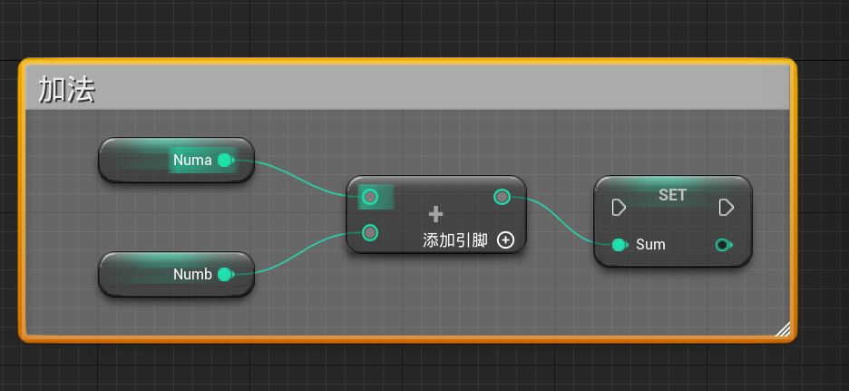
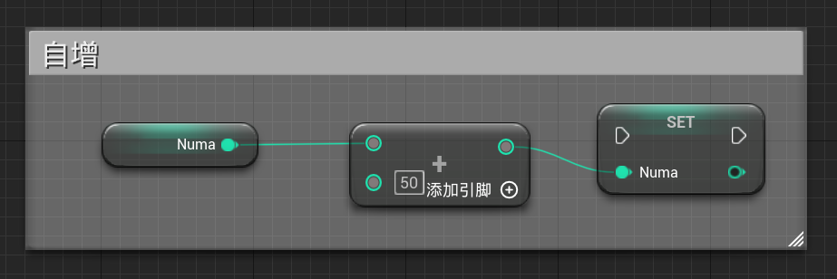

# 02 变量

​	变量创建后都要先编译才能设置默认值。

## 2.0 创建变量

​	可以在左侧的变量创建窗口创建，并且给其赋值正确的类型。

## 2.1 get

​	使用`ctrl`后拖动变量到蓝图窗口，即可创建`get`变量的函数。

## 2.2 set

​	使用`alt`后拖动变量到蓝图窗口，即可创建`set`变量的函数。

## 2.3 自动转换

​	如果需要的类型与给出的类型不匹配，系统会自动进行转换。

## 2.4 添加注释（不执行）

​	选中节点，按下C键，将其转换为注释。

## 2.5 自增

