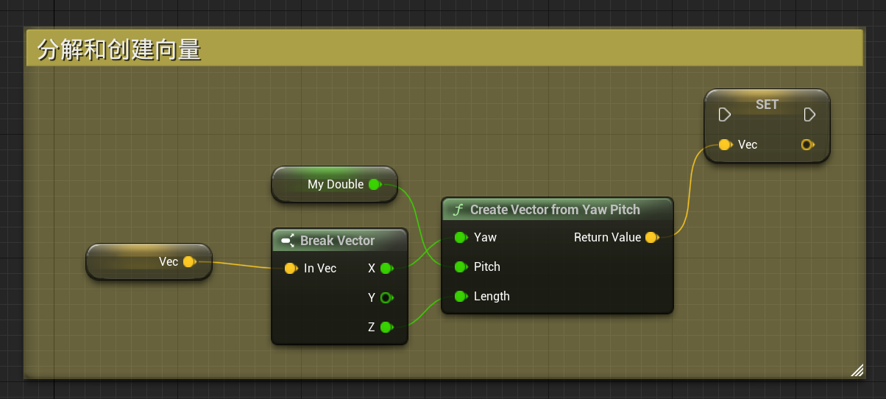
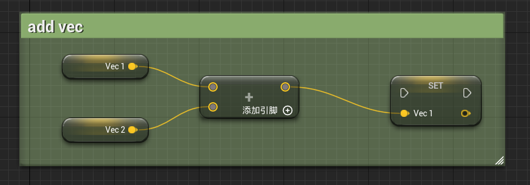
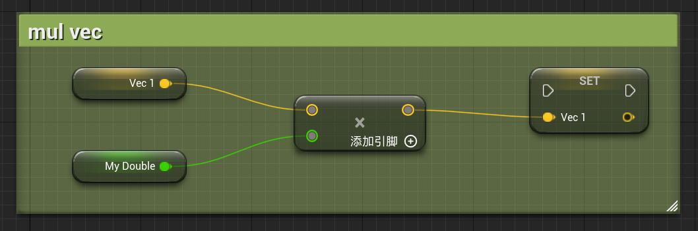

# 04 向量Vector

​	向量是有长度和方向的值，由三个数字组成（X，Y，Z），用于表示位置，旋转和缩放等。

## 4.1 分解和创建向量

## 4.2 向量的运算

### 相加（v+v）

$v_1+v_2 = (v_1.x+v_2.x,v_1.y+v_2.y,v_1.z+v_2.z)$

### 乘法（f*v）

$f*v = (f*v.x,f*v.y,f*v.z)$

