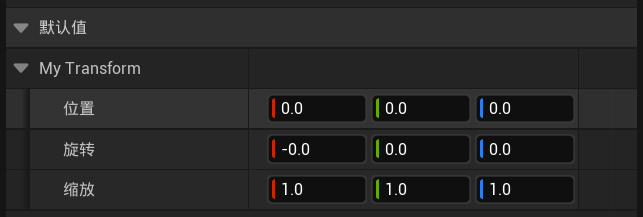
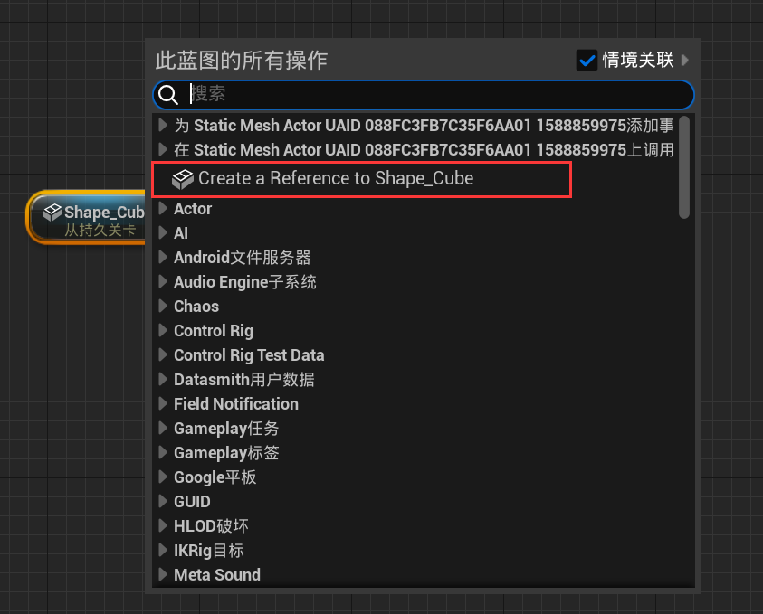
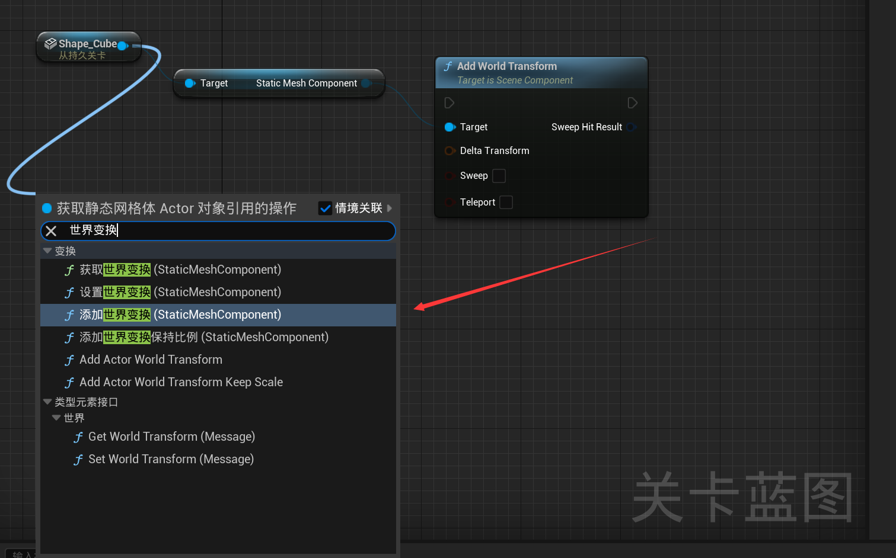
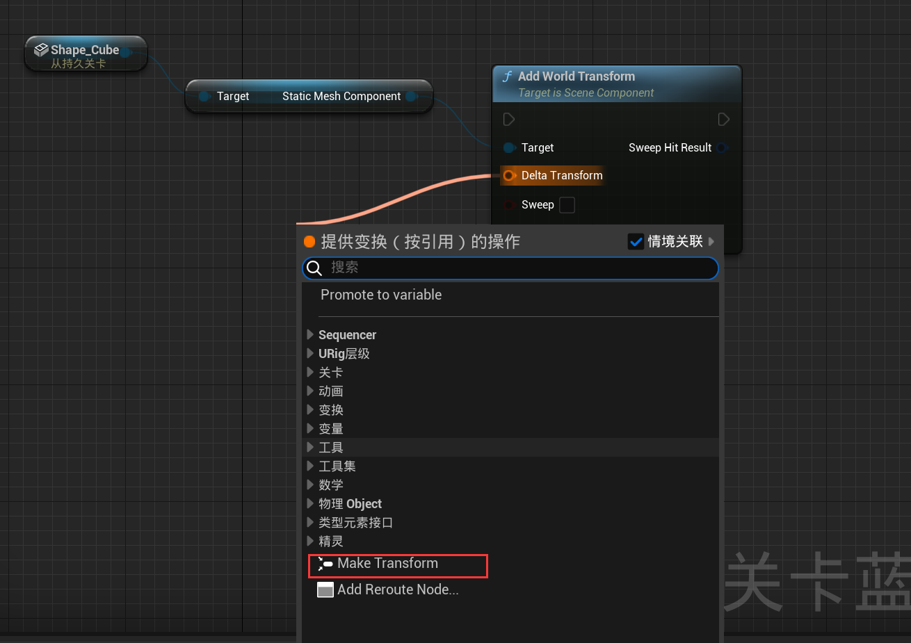
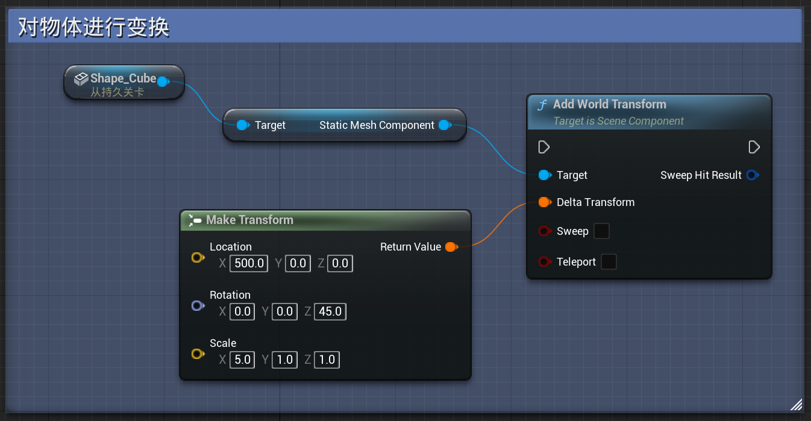

# 06 变换Transform

​	**变换**是结合了位移、旋转、缩放的数据集，通常用于同时获取游戏对象的位置、旋转、缩放等数据

## 6.1 对物体进行变换

* 在关卡中选中某个物体
* 在蓝图面板中右击，创建对应物体的引用

* 从对应的引用拉出连线，添加世界变换

* 从世界变换节点创建transform节点（注：创建的变换是相对变换，而不是绝对变换）

* 创建变换

