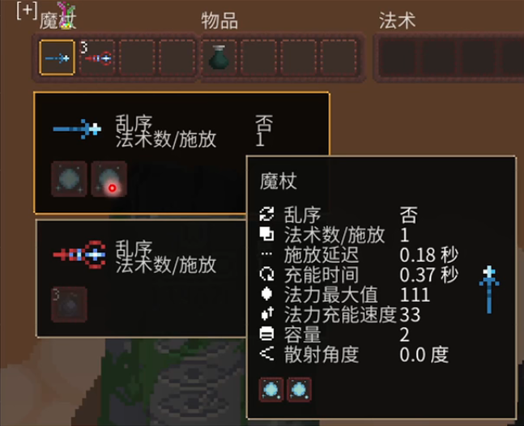
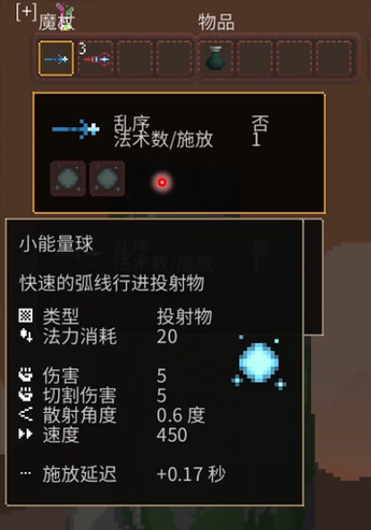
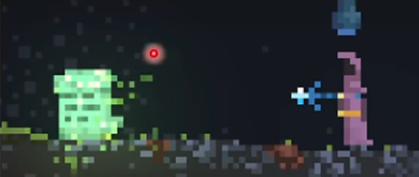

## 基础篇（前期发育与过度1）

#### 1.法杖属性

> 法杖是法术的容器，也是影响法术释放的重要媒介。

如图，共有以下属性：

* 乱序：释放是否按照法术栏的顺序。
	* 否说明是顺序的，即否杖
* 法术数/释放：一次释放的法术数量
* 释放延迟：两次释放之间的间隔时间
* 充能时间：一组法术结束后需要重新装填的时间
* 法力最大值：装备上后，自身法力能达到的最值。
* 法力充能速度：每秒恢复的蓝量
* 容量：法术的容量
* 散射角度

**注意：**在最后一个法术打完之后，释放延迟和充能时间同步开始计时，所以，取最大的作为延迟时间。

#### 2.法术属性

> 法术是真正释放的内容。

如图，共有以下属性：

* 类型
* 法力消耗：单个法术的消耗量
* 伤害
* 切割伤害：另一种伤害，与伤害叠加计算
* 散射角度
* 速度：法术的飞行速度
* 释放延迟：在法杖的释放延迟基础上，再加上的延迟。

注意：法杖和法术不能自由编辑（只有在圣山才可以）

---

#### 3.石板

> 石板能造成意外死亡。属于物理伤害（与物体的移动速度和大小有关，即动量）。

意外死亡：能掉落双倍金币（人为造成的意外也是意外）

拾取地点：岩浆湖边上

**注意：**人物不受物理伤害，除非坍塌的混泥土。

#### 4.第一层

* 先去最右边拿石板
* 探索第一层——矿场
* 第一层的最左边是坍塌矿场，精英怪较多
* 血量<30，可以下层
* 尽量赚到600-800下层
	* 天赋ROLL机：200+400

#### 5.实体与背景

* 一些背景的根部的方块消失了，就会变成实体
	* 例如：树、蘑菇

#### 6.地形破坏

* 不同的物质有不同的特性和硬度
* 不同的法术有不同的破坏能力
	* 普通法术只能破坏泥土，不能破坏岩石（炸弹可以）
* 注意：地雷的破坏力很低

#### 7.地图

* 主线：矿场
* 右边：神树
* 左边：...

#### 8.水

##### 1.使用

* 左键倒水，右键喝水

* 喝水去毒，将水倒入毒液能污染毒液

##### 2.装水

* 将瓶口举低

##### 3.水循环

水遇到火会蒸发，但是水蒸气会很快再次滴下来，总量不变。