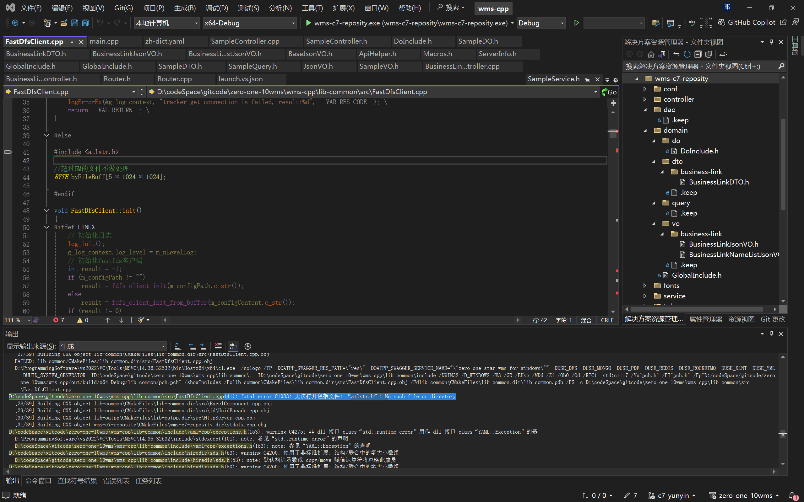
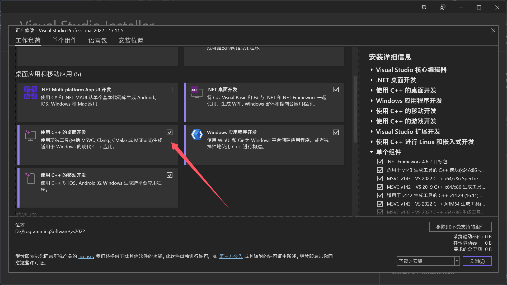
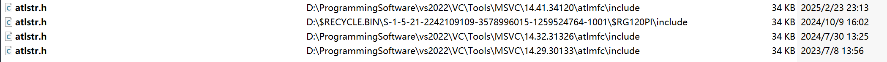
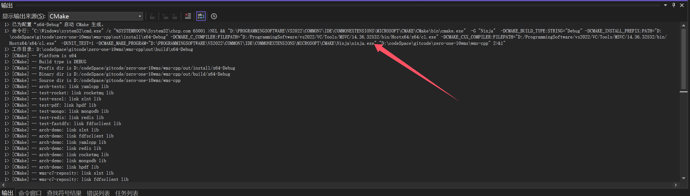

# VS找不到atlstr.h头文件

如图，在编译代码的时候用到了atlstr.h这个文件，但是找不到：

正常来说应该是存在的，毕竟这个代码是多人合作编译，其他人并未出现这个问题。于是一通搜索，是由于VS的C++桌面开发组件没有安装。然而这个组件应该是一开始安装VS就做好了安装的，事情变得很奇怪，我重新检查了VS Installer，确实是存在这个组件的。

于是我就全局搜了一下这个文件，发现它确实存在于我的电脑上：

并且可以清楚地看到，在不同版本下都有这个文件，但是，我注意到我编译使用的cl版本，并不属于它们中的任意一个：

VS的cmake工具配置了一个出乎意料的cl版本，它既不是最新的14.41，也不是最旧的14.29。

当然，我首先就想到了环境变量的问题Path。我极大可能之前配置了有关的路径，检查后确实如此。然而即使我将Path中的路径去除，删除了cmake缓存，依然选择了这个cl版本。

我打开了路径`D:\ProgrammingSoftware\vs2022\VC\Tools\MSVC\14.36.32532`，发现与其它路径相比，下面缺少了atlmfc的文件夹。很显然，我需要去手动添加。

最终，在VS Installer中找到了14.36版本的atl组件，安装上，终于成功了。