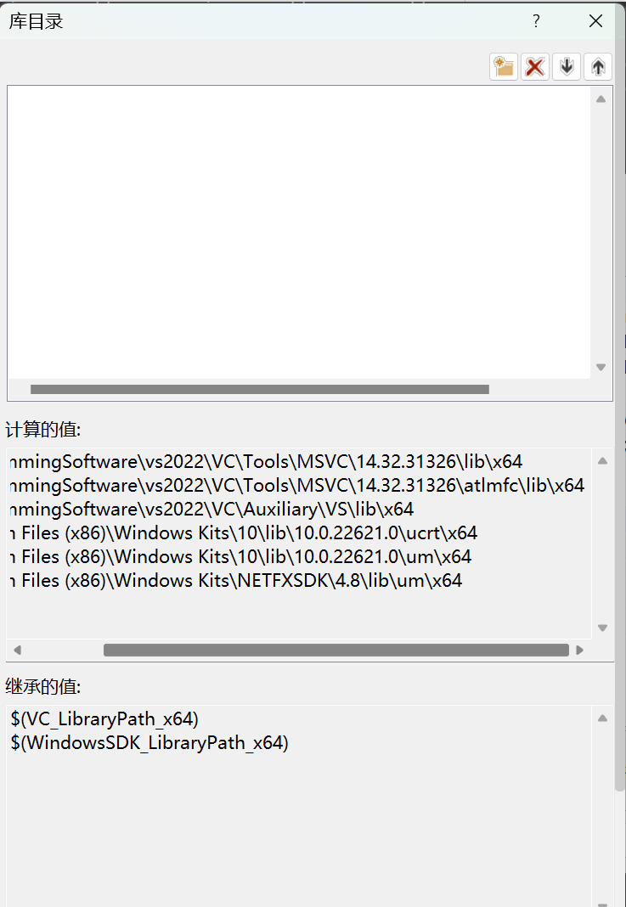
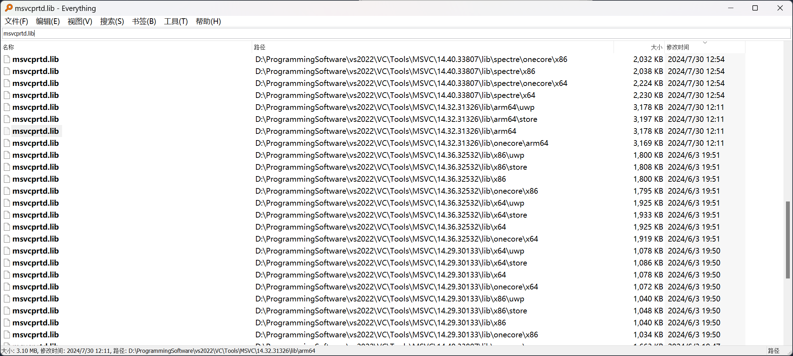
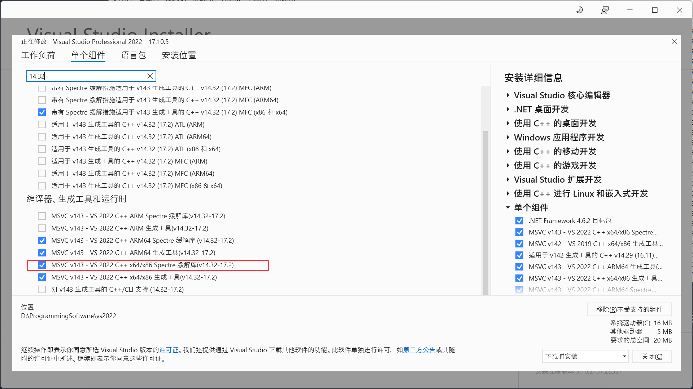

# VS添加ARM64组件导致LINK1104:can not open file "msvcprtd.lib"

## 起因

​	由于需要对arm架构的程序进行交叉编译，在VS上跟着CSDN的教程，安装了arm64的交叉编译工具链。然而，当安装完成后，原本的x64/x86代码就不能正常运行了，报错`LINK1104:can not open file "msvcprtd.lib"`。

## 推理

​	这个错误很奇怪，我从未见过它。在网上一通搜索，大体上是与Spectre 缓解有关的库缺失了。但是这个东西我不曾使用过，并且网上的教程是将项目属性中的Spectre 缓解禁用了，但我的设置本身就是已禁用。

​	于是，我只能在github上寻找，看是否存在别的说法。研究了半天，找到了这句话：

>Spectre mitigation is enabled but Spectre mitigated libraries are not found. Verify that the Visual Studio Workload includes the Spectre mitigated libraries.
>
>Install Spectre libraries.

​	我看到之后灵机一动，既然它要链接这个lib，那么是在哪里配置了链接呢？于是我打开属性的VC++中，在附加库目录中找到了这个配置：

​	它显示引用了我的`VS2022\VC\Tools\MSVC\14.32.31326\lib\x64`下的lib。很明显，问题应该出在这里。我在everything中搜索了`msvcprtd.lib`这个库，但是并未在这个目录下出现它，但是却在类似的目录，最后平台不同的地方出现了：`VS2022\VC\Tools\MSVC\14.32.31326\lib\arm64`。于是我打开了那个目录，果然，下面只有arm64，却没有x64和x86。我又观察了everything的搜索结果，显示在其它版本下却有x64和x86的lib目录：

​	到这里就很明显了，VS安装ARM组件的时候，将其它组件的默认项目配置也自动更新到了14.32.31326版本，但是我并没需要更新它们的版本，导致根本就不存在对应新版本的lib。

## 解决

​	解决方法就是，在VS Installer中下载对应版本的Spectre 缓解，应该在目录下就会得到对应的lib。果然如此。（可能回退版本或者修改默认配置文件也行，但是我并未找到对应的方法。）

