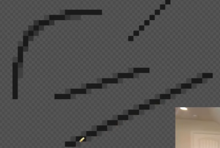

## 像素画处理（步骤关键词）

#### 1.基本

* 形状
* 亮度
* 边界

#### 2.形状步骤

* 使用基本形状绘制
* 再细修

##### 案例1

##### 案例2

#### 3.亮度步骤

* 光照区使用高饱和度
* 阴影区使用低饱和度
* 中间过渡

##### 案例1

##### 案例2

#### 4.边界步骤

* 检测图像和负空间的边界，与参照图对比，看是否一致

##### 案例（下方为一个`S`型）

#### 5.深度处理

* 形状导致深度
* 亮度导致深度

##### 案例1（形状）

##### 案例2（亮度）

#### 6.线条整洁

整洁来自：

* 规律
* 最少

##### 案例（弧线和直线）

#### 7.抗锯齿

* 在锯齿处加上半透明色

##### 案例

#### 8.调色盘

* 中间颜色选择HSV，S和V靠近中间的值
* 深色在中间色的基础上，减少5-10H，S和V适当减少
* 浅色在中间色的基础上，增加5-10H，S和V适当增加

