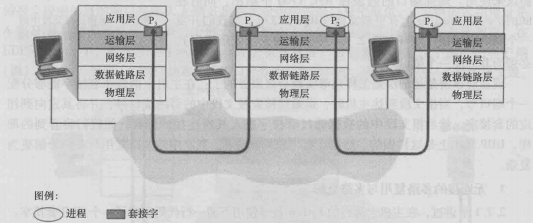

## 3.2多路复用和多路分解

> 在运输层和应用层之间存在多个socket的接口，每一个进程拥有一个或多个socket。运输层并不直接将数据送给进程，而是送给其中某一个socket，由socket发给自己的进程。

---

> 将运输层报文段中的数据交付给正确的socket称为**多路分解**
>
> 将从不同socket收集数据并封装好送给网络层称为**多路复用**

因此，多路复用需要以下条件：

* socket具有唯一标识符
* 每个报文段都有**源端口字段**和**目标端口字段**
	* 端口有16bit（0~65535），其中0~1023为周知端口号

#### 1.无连接的多路复用和多路分解（UDP）

> UDPsocket由一个二元组组成，其中包括目标IP地址和目标端口号。也就是说，不同源发来的同一目标报文会给同一socket。但是TCP不会。
>
> 注意：对于服务器来说，UDPsocket是一个监听的socket，其中包含的目标IP和端口号是指自己的IP和端口号，用于给下层标识的。如果有两个目标IP和端口一致的UDP报文段，运输层会将其投掷到一个socket里，这个socket里就是服务器自己的IP和端口号。

注：在多路复用时，运输层只关心socket给的目标IP地址和目标端口号，不关心哪个端口传给它的。在多路分解时，运输层只关心socket表现出来的端口号。

##### 源IP地址和源端口号

> 虽然socket并不含有源IP地址和源端口号，但是UDP报文段里会有（即IP头），让接收者能将信息传回来。

#### 2.面向连接的多路复用和多路分解（TCP）

> TCPsocket是一个四元组，其中包括源IP，目标IP，源地址，目标地址。
>
> 注意：这意味着，如果两个来自不同主机或者不同进程的TCP报文段，即使目标一致，也会被传输层投递到不同的socket里。

服务器事先并不知道客户端的socket连接是什么，但是会创建一个socket等待客户端连接。这个socket只设置自己的端口，运输层以此判断是否将连接发送给该socket。在监听到对应的连接后，服务器会专门创建一个面向该客户的（含有对应IP地址和端口的）socket，并以该socket作为与该客户通信的socket。（具体实现是使用accept函数将监听socket获取的信息移植到当前socket上。）

#### 3.Web服务器和TCP

> Web服务器使用HTTP协议。

在持续HTTP下：

* 客户端与服务器使用同一个socket交换报文

在非持续HTTP下：

* 每一对请求和响应都会创建一个新的socket来交换报文
	* socket的频繁创建和关闭会影响性能

