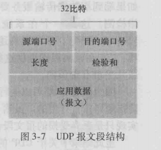
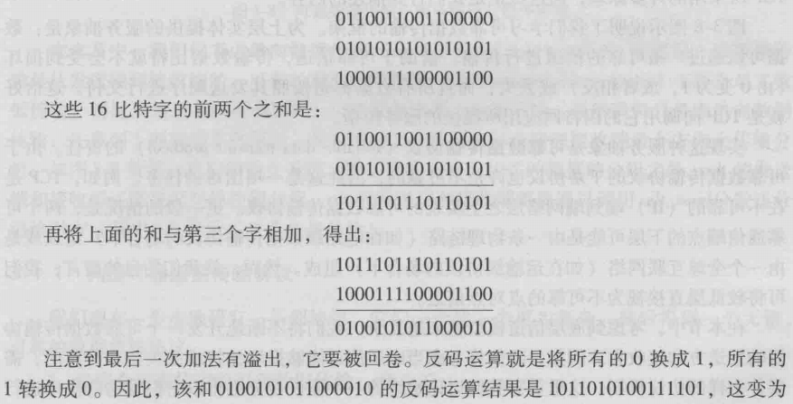

## 3.3无连接运输：UDP

> UDP仅在IP协议的基础上提供多路复用、多路分解的服务和少量的差错检测。

使用UDP的原因：

* 应用层能更精细地控制发送：
	* UDP没有拥塞控制机制，因此发送时间和数据量大小完全由应用层来决定。而TCP中，应用层发送数据，TCP会根据不同实际情况来决定发送时间和每次数据大小，应用层的控制少。
* 无需建立连接：
	* TCP在开始传输数据之前要进行三次握手。UDP没有建立连接的时延。
* 无连接状态：
	* TCP需要在端系统中维护连接状态，因此在TCP传输中会有状态参数。UDP没有这些参数。
* 分组首部开销少：
	* TCP首部20字节
	* UDP首部8字节

#### 3.3.1 UDP报文段结构

> UDP首部仅有四个字段，每个字段两个字节，如图：

* 端口号：2字节，16位，0~65535
* 长度：指明报文段字节数（首部+数据）
* 校验和：接收方用于检测该报文段是否出现差错（计算公式如下）

#### 3.3.2 UDP校验和

计算方法：每16位进行一次加和（除了校验和部分），如果溢出则回卷（最低位进1）。最终结果再进行反码运算，存入校验和中。

**案例**

在接收方，将所有的16位进行加和（包括校验和），得到的结果如果不是全1，则出错。（校验和 = 所有加和取反码，所以其它加和再次加上校验和应该为16个1）

