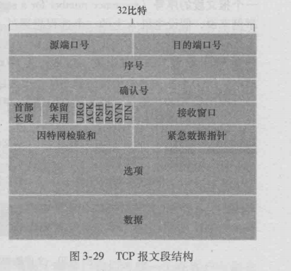
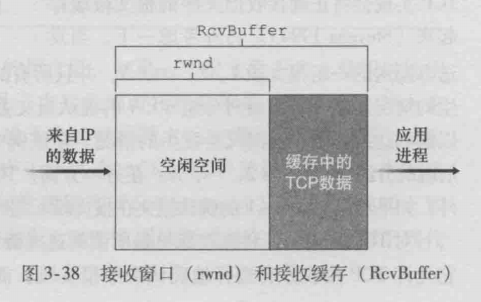
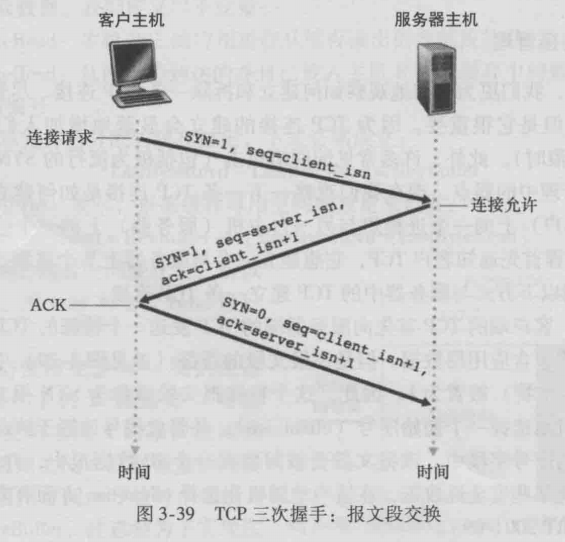
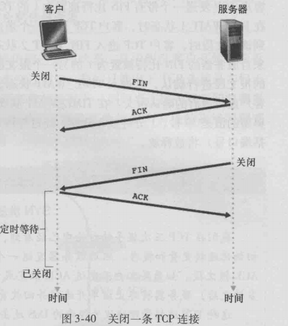
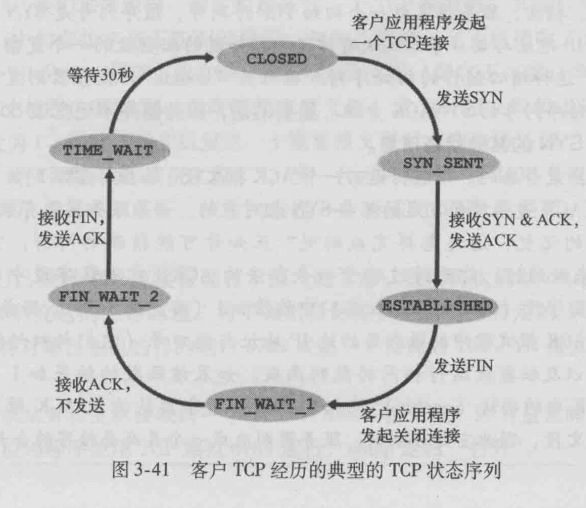
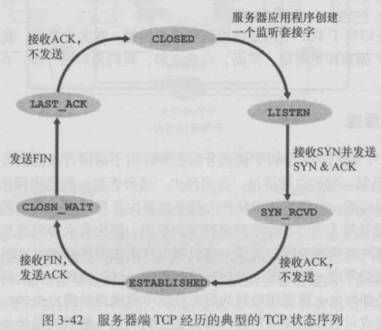

## 3.5面向连接的运输：TCP

> TCP建立在可靠数据传输原理之上。
>
> 同时依赖原理：差错检测、重传、累积确认、定时器、首部字段。

#### 3.5.1 TCP连接

> TCP协议的连接状态只保留在两个端系统中，而不在中间的网络元素运行。

1.TCP提供**全双工服务**：两个进程之间可以在同时双向发送信息。

2.建立TCP连接的过程：（**三次握手**）

* 客户端发送一个特殊的TCP报文段（不含应用层信息）
* 服务器响应一个特殊的TCP报文段（不含应用层信息）
* 客户端响应一个特殊的TCP报文段（可以有应用层信息）

3.最大报文段长度（MSS）：报文段中应用层数据的最大长度。

4.TCP连接的组成包括：两台主机上的缓存，变量和与进程连接的socket

#### 3.5.2 TCP报文段结构（如图）

**简介**

* 源端口号和目的端口号：各占16bit
* 序号和确认号字段：各占32bit，用于实现可靠数据传输服务（详见下方）
* 接收窗口字段：16bit，用于流量控制，指示接收方愿意接收的字节数量 
* 首部长度字段：4bit，指示了TCP首部长度（单位：32bit的字）注：TCP首部长度可变
* 选项字段：可变长度，用于发送方和接收方协商最大报文段长度（MSS）。
* 标识字段：6bit。
	* ACK：对上一报文段有效的确认。
	* RST、SYN、FIN：用于连接的建立与拆除。
	* PSH：指示立即将数据交付给上层。
	* URG：指示报文段中存在紧急数据。
* 紧急数据指针：16bit，当URG的bit有效时，指向紧急数据的最后一个字节。（即紧急数据尾）

##### 1.序号与确认号

1.序号：序号是以字节为单位的，指的是报文段数据的首字节编号。假如MSS为1000，则第一个报文段序号为0，第二个报文段序号为1000。

2.确认号：期望收到的下一报文段的序号。例如已经收到0-535字节的数据，则应该发536的确认号。

3.**累计确认**：TCP只确认流中第一个丢失的字节。例如已经收到0-535和900-1000字节，则应该发536的确认号。

##### 2.Telnet学习案例：序号与确认号

> Telnet将数据发送给服务器后，服务器会将数据发回来，以表示成功发送。数据会显示在Telnet的屏幕上，称为”回显“。

#### 3.5.3往返时间的估计与超时（略）

#### 3.5.4可靠数据传输（略）

#### 3.5.5流量控制

> TCP的接收方使用一个缓存来存储收到的数据报，如果发送方的发送速度大于接收方的上层应用的读取速度，接收缓冲就会溢出。因此TCP提供**流量控制服务**。

流量控制服务的实现是：发送方维护一个**接收窗口**的变量（rwnd），该变量告知发送方：接收方剩余可用缓冲空间数量。

**公式：**
$$
rwnd = RcvBuffer - (LastByteRcvd - LastByteRead)
$$
**解释：**
$$
接收窗口的大小 = 缓冲区大小 - （缓冲区中最后一个字节编号 - 缓冲区已读的字节编号）
$$

> 由于TCP是全双工的，接收方会将自己当前rwnd的值放入报文段的接收窗口字段中。

#### 3.5.6TCP连接管理

##### 1.建立连接：（三步）

* 一：客户端TCP向服务器TCP发送一个特殊报文段。
	* 不含应用层数据
	* SYN标识位置1
	* 随机选择一个初始编号client_isn，写入序号字段
* 二：服务器从该报文段中取出SYN报文段，为该TCP连接分配缓存和变量，并发送允许连接的报文段。
	* 不含应用层数据
	* SYN标志位置1
	* 确认号字段设置为client_isn+1
	* 随机选择一个初始编号server_isn，写入序号字段
* 三：客户接收SYNACK报文段，为该连接分配缓存和变量。并发送一个报文段给服务器。
	* 可以发送应用层数据
	* SYN标志位置0
	* 确认号字段设置为server_isn+1
	* 序号字段为client_isn+1

##### 2.关闭连接：（四步）

* 一：客户向服务器发送一个特殊的TCP报文段
	* FIN标志位置1
* 二：服务器向客户回送一个确认ACK报文段
* 三：服务器发送自己的终止报文段
	* FIN标志位置1
* 四：客户向服务器回送一个确认ACK报文段

##### 3.客户的TCP连接状态（对应上面的连接的三步与关闭的四步）

建立连接过程：

* 一：CLOSED->SYN_SENT
* 二：SYN_SENT->ESTABLISHED
* 三：ESTABLISHED

关闭连接过程：

* 一：ESTABLISHED->FIN_WAIT1
* 二：FIN_WAIT1->FIN_WAIT2
* 三、四：FIN_WAIT2->TIME_WAIT
* 等待30s：TIME_WAIT->CLOSED

> 对应的服务器TCP连接状态变化图：

##### 4.服务器端口不接受连接（端口没被使用）

> 当服务器端口收到TCP连接，但该端口并无socket时，主机将回送一个特殊重置报文段，该报文段将RST标志位置1。
>
> 在UDP的情况下，主机将发送一个特殊的ICMP数据报。