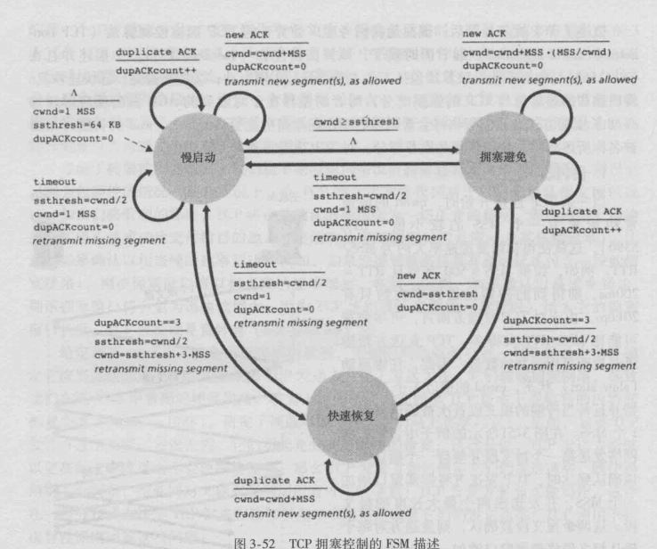

## 3.7TCP拥塞控制

> 方法：通过发送方所感知的网络拥塞程度来限制发送速率。

需要解决三个问题：

* 如何限制发送速率
* 如何感知拥塞
* 采用何种算法来限制

##### 1.如何限制

> TCP的每一端都由
>
> * 发送缓存
> * 接收缓存
> * 公式rwnd = RcvBuffer - (LastByteRcvd - LastByteRead)里的变量
>
> 组成。

拥塞控制机制监视一个新变量：拥塞窗口（cwnd）：
$$
LastByteSent - LastByteAcked \leq min(cwnd,rwnd)
$$

$$
rate = cwnd/RTT
$$

> 发送速率 = 拥塞窗口 / 往返延迟

##### 2.如何感知

* 超时
* 收到3个冗余Ack

##### 3.采用算法

* 慢启动
* AIMD
* 超时事件后的保守策略

