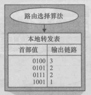

## 4.1导论

#### 4.1.1.一些概念

1.网络层的两个功能：

* 转发：将一个分组从一个输入链路接口转移到一个合适的输出链路接口上
* 路由选择：决定分组从源到目的地所采取的端到端的路径

2.转发表：每台路由器拥有的一张本地表。在接收到分组时，根据分组首部首部字段的值在表中进行查询。

3.连接建立：某些网络层体系要求在源到目的地之间所选择的路径彼此握手，以便在分组交换前建立起状态。

#### 4.1.2网络服务模型

> 不同的网络层模型提供不同的服务，可能拥有的服务有：

* 确保交付
* 具有时延上界的确保交付
* 有序分组交付
* 确保最小带宽
* 确保最大时延抖动
* 安全性服务

#### 4.1.3路由表的配置方式

##### 1.传统方式（分布式）

由每台路由器自己根据提前装载好的路由选择算法配置路由表。

##### 2.SDN(software define network)方式（集中式）

由一个远程服务器连接所有路由器，根据服务器上当前装载的路由选择算法来配置每个路由器的流表。

**优点：**

* 耦合度低，便于更换算法重新配置
* 流表比路由表更灵活
	* 允许解析更上层的多个协议字段
		* TCP的字段
		* UDP的字段
	* 允许进行更多样的动作
		* 转发
		* 泛洪
		* 丢弃

