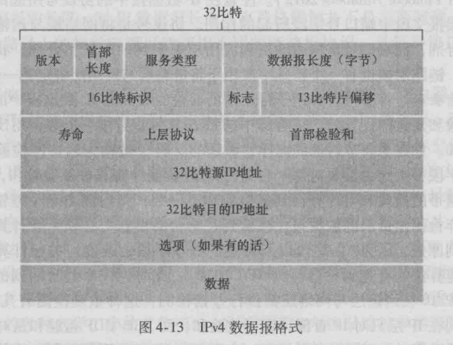

## 4.2IP Network Protocol

#### 4.2.1数据报格式

> 网络层分组称为数据报。

##### 1.IPv4格式

> 格式如下图：

**解释：**

* **版本号：**4bit，规定了IP协议版本。
* **首部长度：**4bit，标注实际数据从哪里开始，即首部的长度。（由于IP数据报允许包含可变数量的选项）
	* 如果没有选项，则一般的数据报首部是20字节的长度
	* 最大首部长度为60字节
* **服务类型：**8bit，用于将一些不同类型的IP数据报区分开来（低延迟、高吞吐量、可靠性等）。
* **数据报长度：**16bit，表示IP数据报的总长度（首部+数据），以字节为单位。理论最大值为65535。
* **标识、标志与片偏移：**16+3+13bit，这三个字段与IP分片有关。
* **寿命：**8bit，TTL字段保证数据报不会永远在网络中循环。每经过一台路由器，该字段的值减1。
	* 最大寿命255
* **协议：**8bit，用于指示IP数据报的数据部分交付给哪个运输层协议。
	* 6代表TCP
	* 17代表UDP
	* 1代表ICMP
* **首部检验和：**16bit，对首部中每2字节进行加和，最终结果取反。
	* 注意：每经过一次路由器都要重算，因为TTL字段变化了。
* **源IP和目标IP地址：**各占32bit。
* **选项：**允许IP首部被扩展。该字段用于一些可选的报头设置，主要用于测试、调试和安全的目的。这些选项包括严格源路由（数据报必须经过指定的路由）、网际时间戳（经过每个路由器时的时间戳记录）和安全限制。
	* 使用0填充末尾保证报头长度是32位的整数倍。	
* **数据：**用于存储TCP、UDP、IMCP等协议的数据。

##### 2.IP数据报分片

> 底层链路层协议可能不能发送过大的IP数据报，因此需要对数据报进行分片。

#### 4.2.2IPv4编址

> IP地址具有32位，形式为a.b.c.d/x。其中a，b，c，d代表IP地址，/x代表子网掩码的位数。

##### 1.IP地址的分类

* a类：以0开头，后面跟着7为作为网络地址，剩下的24位作为主机地址
* b类：以10开头，后面跟着14位作为网络地址，剩下的16位作为主机地址
* c类：以110开头，后面跟着21位作为网络地址，剩下的8位作为主机地址
* d类：广播地址

* e类：保留地址

##### 2.特殊地址

* 网络部分全0：表示当前网络
* 主机部分全0：表示当前主机
* 主机部分全1：向网络的所有主机广播
* 127.x.x.x：回环地址，从本机应用层下至IP层就回来了。用于测试

##### 3.内网专用IP地址

> 一些地址在每一个内网中都有，但不会出现在公网里。路由器不对目标地址是专用地址的分组进行转发。

a类：10.0.0.0~10.255.255.255						/8

b类：172.16.0.0~172.31.255.255					/16

c类：192.168.0.0~192.168.255.255				/24

##### 4.CIDR

> 将子网一般化，允许出现任意位数的网络地址。其实质是在大网络下划出子网。因此需要子网掩码来确认子网的网络地址。（大网络仍然根据a，b，c类划分）

##### 5.DHCP（动态主机配置协议）

> 用于动态配置主机的IP地址和子网掩码。要求所在网络拥有一个DHCP服务器。

**配置过程：**

* 主机广播是否存在DHCP服务器
* DHCP服务器（可能存在多个）收到并广播推荐的IP地址
* 主机选择一个DHCP服务器，发送请求报文。（同时配置好了自己的地址）
* 服务器发送Ack

