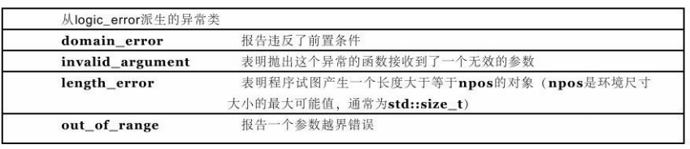
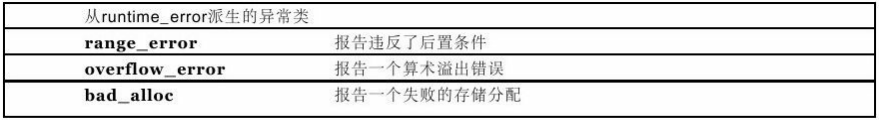

## 1.6 标准异常

> C++提供了标准异常类便于使用。可以据此派生自己的异常类。在`<exception>`库中定义。
>
> 另外还提供了标准的派生异常类在`<stdexcept>`：
>
> * logic_error
> * runtime_error
>
> 可以通过成员函数what()来获取保存的信息。

#### 1.使用标准异常

> 由于`stdexcept`中的派生异常构造自带`std::string`的参数，相比于裸异常更适合传入参数。

```C++
#include <stdexcept>
#include <iostream>
using namespace std;

class MyError : public runtime_error
{
public:
    MyError(const string &msg = "") : runtime_error(msg) {}
};

int main(int argc, char const *argv[])
{
    try
    {
        throw MyError("my message");
    }
    catch (MyError &x)
    {
        cout << x.what() << endl;
    }

    return 0;
}

```

#### 2.更多异常类

##### 2.1 logic_error派生



##### 2.2 runtime_error派生

