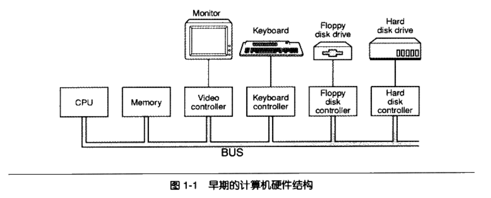
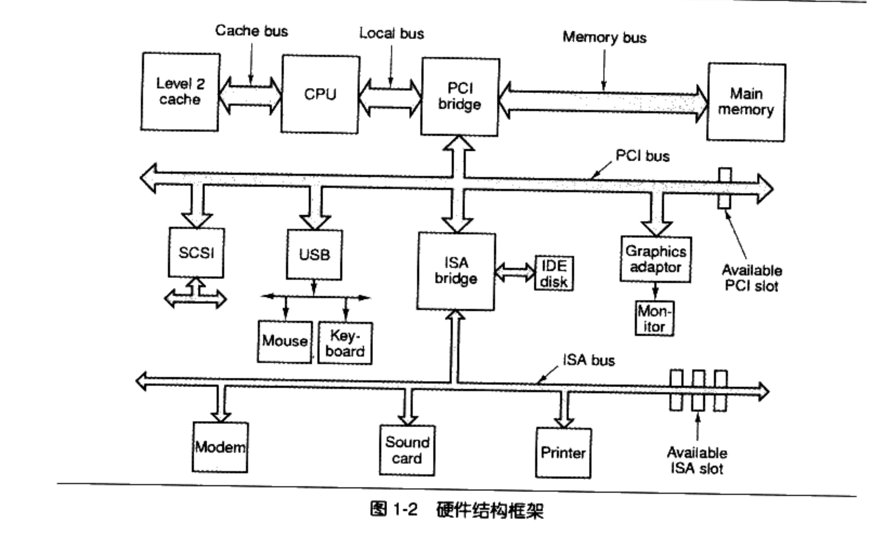

# 硬件结构

## 早期设计

总线BUS：早期计算机的CPU、内存的频率基本一致，直接连接在总线上。

IO控制器：IO设备速度会慢很多，且没有图形设备。为了协调CPU与IO设备进行通信，每一个设备都有一个IO控制器。

## 南北桥PCI/ISA设计

> 位于中间的是连接所有高速芯片的北桥，左边是CPU，负责所有的控制与运算；北桥还连接几个高速设备，包括右边的内存和下面的PCI总线。

1. 系统总线：由于CPU频率提升，内存跟不上CPU的速度，因此出现了与内存频率一致的系统总线。CPU采用倍频的方式与系统总线进行通信。
2. 北桥芯片：随着图形化的普及，图形芯片需要跟CPU和内存大量交换数据，IO总线不能满足快速交换的需求，因此设计出北桥芯片用于**图形芯片、CPU、内存**三者高速交换数据。
3. 南桥芯片：低速设备如果也连接在北桥芯片上会导致设计复杂，因此设计出专门处理**低速设备**的南桥芯片。磁盘、USB、键盘、鼠标等设备都连接在南桥芯片上，而南桥芯片汇总后连接到北桥上。

