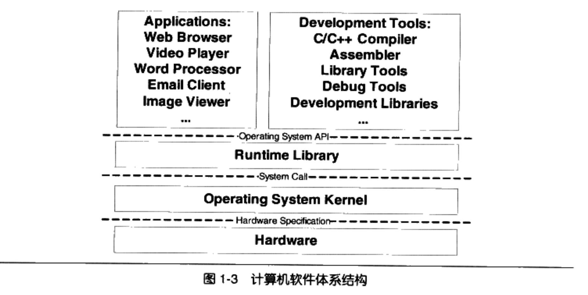

# 中间层与接口

系统软件分为两部分：

* 平台性的：操作系统内核、驱动程序、运行库和系统工具
* 程序开发：编译器、汇编器、链接器等开发工具和开发库

## 软件体系结构

## 中间层和接口

> 上下两层之间通信需要有通信协议，即接口。除了应用程序和硬件层，其它都是中间层，每个中间层都是对下面那层的包装和拓展。

从整个层次结构上看(如上图)，应用程序和开发工具都是属于同一个层次的，因为它们都使用了一个接口，即操作系统API。

运行库 使用操作系统提供的系统调用接口（system call）。系统调用接口实现中往往以软件中断的形式提供，比如linux中使用0x80号中断作为系统调用接口，而windows中采用0x2E号作为系统调用接口（从windows xp sp2开始采用一种全新的系统调用方式）。

操作系统内核层 调用硬件提供的接口，这种接口被称为 硬件规格（hardware specification）。它规定了驱动程序如何操作硬件，如何与硬件进行通信。硬件厂商负责提供硬件规格，而操作系统和驱动程序的开发者阅读 硬件规格文档 规定的各种硬件编程接口标准去编写对应的程序。

