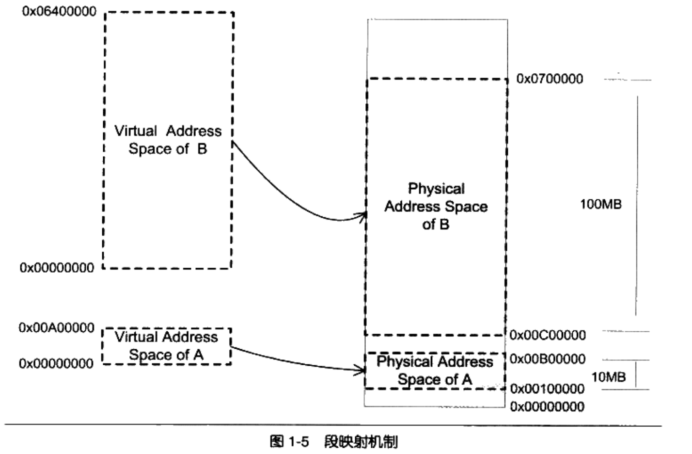

# 内存与隔离

## 早期

早期的计算机中，进程直接访问物理地址，只要所需的内存大小不超过物理内存的大小，就不会有问题。

为了更好的利用硬件资源，人们考虑将内存分给多个程序使用。但是如果直接将内存分给两个应用进程使用，那么会有下面的问题：

* **地址空间不隔离**：所有进程都直接访问物理内存，很容易修改其它进程的内存数据导致问题
* **内存使用率低**：涉及到调度时，监控程序需要将进程本身大量数据从内存写入到磁盘，将另一个进程再读入内存，效率十分低下。
* **程序运行地址不确定**：程序每次装入时，都需要从内存中分配一块足够大的空闲区域，这个地址不确定导致程序编写困难。因为程序本身很多地址是写死的，例如访问数据的固定地址和跳转的固定地址。这里涉及到**重定位**问题。

## 隔离

### 思路

解决上述问题的办法依旧是增加中间层。

将程序给出的地址看成是一个虚拟地址，通过某种映射可以转换为物理地址，只要管理好虚拟地址到物理地址的映射过程，就能保证任意一个程序能够访问的物理内存区域与另外一个程序不重叠，以达到地址空间隔离的效果。

### 分段

最开始人们使用的是一种分段的方法。

基本思路是把一段与程序所需要的内存空间大小的虚拟空间映射到某个地址空间。

例如A程序需要10mb的空间，那么虚拟地址到物理空间的映射可以是：

|          | 虚拟空间   | 物理空间   |
| -------- | ---------- | ---------- |
| 起始地址 | 0x00000000 | 0x00100000 |
| 终止地址 | 0x00A00000 | 0x00B00000 |

这样基本解决了地址隔离和重定位的问题：

* 地址隔离：如果A访问的空间超出了0x00A00000，那么硬件会判断这是一个非法访问并拒绝这个地址请求，并报告给操作系统。
* 重定位：无论程序被分配到哪个物理空间，对于程序而言都是透明的，它们只需按照0x00000000-0x00A00000编写程序、放置变量，所以不再需要重定位。

但是依旧不能解决内存使用效率的问题：

* 分段对内存的映射以程序为单位，如果内存不足，被换入换出的总是整个程序，从而导致大量的IO。这种交换方法过于粗糙并且粒度很大。
* 根据局部性原理，程序在某个时间段内只会用到一小部分的数据，大部分数据不会在一个时间段被用到，因此可以进行更小粒度的内存分割和映射的方法。

### 分页

> 分页就是通过更小粒度的内存分割和映射来充分利用局部性原理的方法，从而大大提高了内存的使用率。

分页的基本方法是把地址空间人为地等分成固定大小的页（由硬件支持不同大小的页，操作系统决定使用哪一种）。

例如，PC使用32位的虚拟地址空间，也就是4GB，每个页使用4KB的大小，总共就有1024*1024个页。物理空间也是同样的分法。

**案例**

虚拟空间中的页称为虚拟页，物理内存中的页称为内存页，磁盘中的页称为磁盘页。

假设有两个进程P1和P2，它们的部分页映射到物理页中，部分映射存在于磁盘中，还有一些页尚未被使用还不存在映射。

当发生**页错误**时（VP2和VP3不在内存中），硬件会捕获这个消息，由操作系统接管进程并将VP2和VP3读出到内存里同时更新映射。

保护也是页映射的目的之一，每个页可以设置权限属性（访问、修改等），只有操作系统可以修改这些属性从而保护进程和自己。

### MMU

对于不同的CPU，都采用同一种硬件MMU来进行页映射。一般MMU都集成在CPU内部，看不到独立部件。

在页映射模式下，CPU发出Virtual Address，经过MMU转换后变成Physical Address，再进行后续的操作。