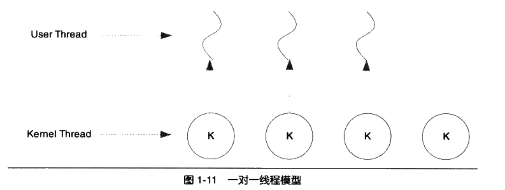
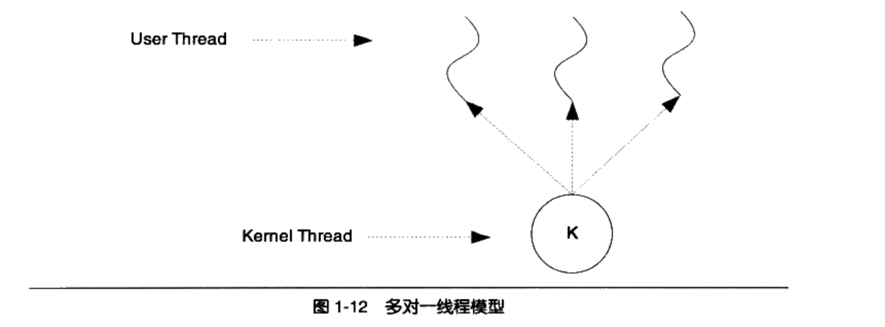
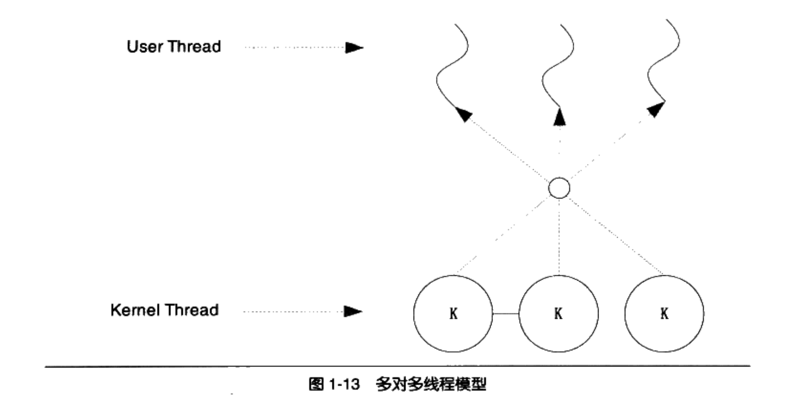

# 三种线程模型

## 一对一模型

一对一模型中，一个用户使用的线程一定对应一个内核使用的线程，反过来不一定。

一般直接使用操作系统API或者系统调用创建的线程都是一对一的线程。

例如： 

* Linux中的clone（带有CLONE_VM参数）。
* Windows中的CreateThread

## 多对一模型

多对一模型将多个用户线程映射到一个内核线程上，线程之间的切换由用户态的代码来进行，因此相对于一对一模型，多对一模型的线程切换要快很多。

多对一模型的问题在于：如果一个用户线程阻塞了，所有的线程都无法执行。同时处理器的增多对多对一模型没有明显提升

多对一模型的好处是：高效的上下文切换和几乎无限制的线程数量。

## 多对多模型

多对多模型将多个用户线程映射到不止一个内核线程上。

相比对多对一模型的好处是：

一个用户线程阻塞不会导致所有用户线程阻塞，因为此时还有别的内核线程可以被调度执行。

同时处理器的增加可以提高这种模型的性能，但少于一对一模型的幅度。