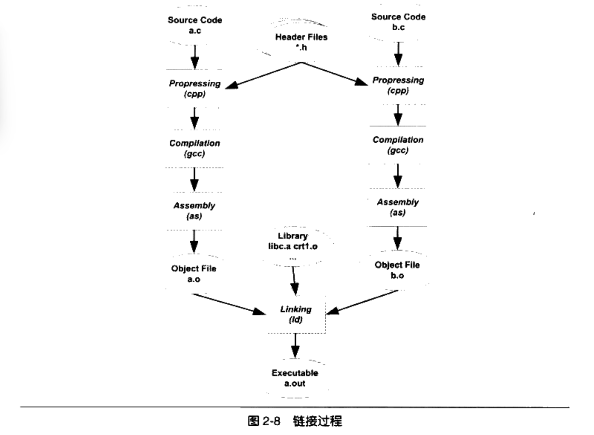

# 模块拼装-静态链接

## 链接的本质

每个源代码独立编译成目标文件，然后按照要求将它们组装起来，这就是链接。

链接的主要内容就是把各个模块之间互相引用的部分都处理好，实质是把一些指令对其它符号的地址的引用加以修正。



上图是最基本的链接过程，在.c文件编译成目标文件（.o）后，目标文件和库一起链接成可执行文件。最常见的库就是运行时库，是支持程序运行的基本函数的集合。库实际上是一组目标的包，即一些常用的代码编译成目标文件后打包存放。

---

链接的过程包括了：

* 地址与空间分配
* 符号决议
* 重定位

## 对函数符号的重定位

例如main.c引用fun.c中的foo()函数，如果没有链接器，在每次func模块重新编译后，都要手动修改main.o中foo符号的正确地址。使用链接器，就可以直接引用其它模块的函数和全局变量而无须知道它们的地址，因为链接器会自行查找到fun中模块的foo的地址，然后修正。

## 对变量符号的重定位

对于定义在其它目标文件中的变量而言也是同样的问题。假设在B中要访问A中的全局变量`var`：`var=42`，则在B中应该有这样一条指令：movl 0x2a var。

检查B模块的目标文件，发现是这样的：

```
C7 05     00 00 00 00    2a 00 00 00	# movl指令的机器码
```

由于在编译B时不知道var的地址，因此编译器只能暂时将这条mov指令的目标地址置为0。等待链接器在将A和B链接起来的时候再将这个地址修正。

这个过程也称为**重定位**，每个要被修正的地方叫一个**重定位入口**。