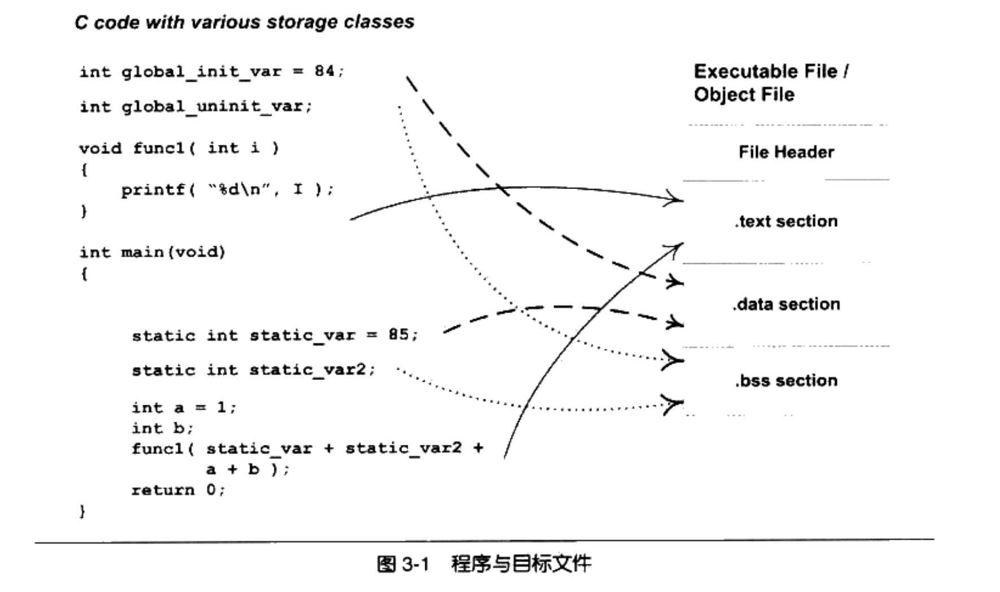

# 目标文件基本结构

## 段

目标文件中的内容除了编译后的机器指令、数据，还应该有链接时必要的一些信息，比如符号表、调试信息、字符串等。这些信息以”段“的形式存储。

| 信息           | 段名             | 说明                                                         |
| -------------- | ---------------- | ------------------------------------------------------------ |
| 代码段         | .code .text | 存储了编译后的代码的机器码                                   |
| 数据段         | .data            | 已初始化的全局变量和局部静态变量                             |
| 未初始化数据段 | .bss             | 未初始化的全局变量和局部静态变量 只是记录了为变量预留的大小，但是实际上硬盘上没有内容，等到实际加载进内存才有内容 |

## 文件头

ELF文件的开头是一个文件头，描述了一个文件的属性，包括是否可执行、是静态链接还是动态链接、如果是可执行文件的入口地址、目标硬件、目标操作系统等信息。

文件头还包括一个段表，是用于描述各个段的数组。每一项是段在文件中的偏移位置以及段的属性等。从段表中可以得到各个段的所有信息。

## 数据与指令分段的原因

* 虚存区域的属性不同：数据区域对于进程是可读可写的，指令区域对于进程是只读的。分段可以使得两个区域的权限不同，从而防止程序的指令被纂改
* 提高各自的缓存命中率：指令和数据分段有助于提高程序的局部性。
* 共享指令节省内存（核心原因）：当操作系统运行多个该程序的副本时，指令都是一样的，内存中只需保存一份指令和只读数据。其它数据是各个进程私有的。用这种方式可以节省大量内存。