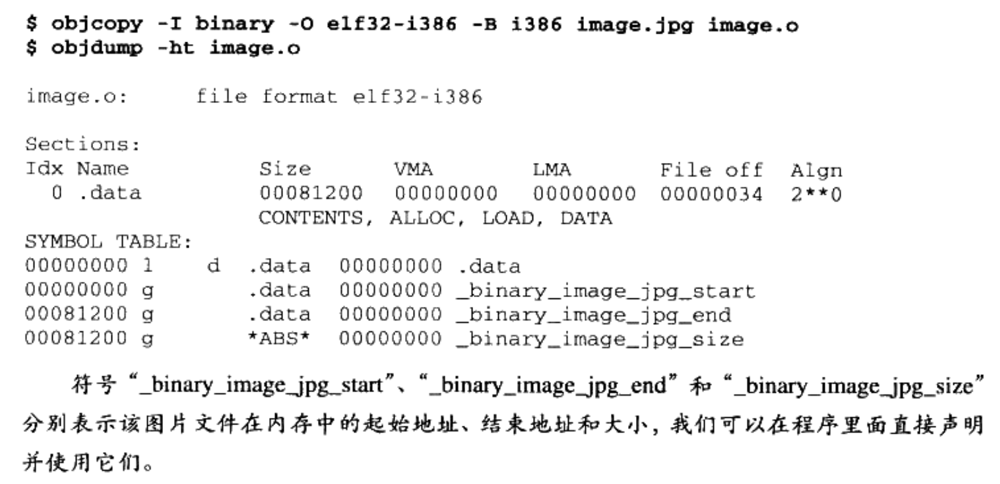

# objdump挖掘目标文件

## 准备

分析代码如下：

```C++
/*
 * Simple.c
 * 
 * Linux:
 * gcc -c Simple.c
 * 
 * Windows:
 * cl Simple.c /c /Za
 */
int printf(const char* format, ...);

int global_init_var = 84;
int global_uninit_var;

void func1(int i)
{
    printf("%d\n", i);
}

int main()
{
    static int static_var = 85;
    static int static_var2;

    int a = 1;
    int b;

    func1(static_var + static_var2 + a + b);

    return a;
}
```

只编译不链接：

```shell
gcc -c Simple.c
```

## objdump -h

### 命令结果

使用-h查看目标文件各个段的基本信息：

```shell
$ objdump -h Simple.o

Simple.o:     file format elf64-x86-64

Sections:
Idx Name          Size      VMA               LMA               File off  Algn
  0 .text         00000062  0000000000000000  0000000000000000  00000040  2**0
                  CONTENTS, ALLOC, LOAD, RELOC, READONLY, CODE
  1 .data         00000008  0000000000000000  0000000000000000  000000a4  2**2
                  CONTENTS, ALLOC, LOAD, DATA
  2 .bss          00000008  0000000000000000  0000000000000000  000000ac  2**2
                  ALLOC
  3 .rodata       00000004  0000000000000000  0000000000000000  000000ac  2**0
                  CONTENTS, ALLOC, LOAD, READONLY, DATA
  4 .comment      0000002c  0000000000000000  0000000000000000  000000b0  2**0
                  CONTENTS, READONLY
  5 .note.GNU-stack 00000000  0000000000000000  0000000000000000  000000dc  2**0
                  CONTENTS, READONLY
  6 .note.gnu.property 00000020  0000000000000000  0000000000000000  000000e0  2**3
                  CONTENTS, ALLOC, LOAD, READONLY, DATA
  7 .eh_frame     00000058  0000000000000000  0000000000000000  00000100  2**3
                  CONTENTS, ALLOC, LOAD, RELOC, READONLY, DATA
```

### 各个节说明

各个节的意义：

- `.text`：包含程序的执行代码。属性包括：CONTENTS, ALLOC, LOAD, RELOC, READONLY, CODE。
- `.data`：包含初始化的全局变量和静态变量。属性包括：CONTENTS, ALLOC, LOAD, DATA。
- `.bss`：包含未初始化的全局变量和静态变量。属性只有：ALLOC。
- `.rodata`：包含只读数据，如字符串常量。属性包括：CONTENTS, ALLOC, LOAD, READONLY, DATA。
- `.comment`：包含文件的注释信息，常用于存放编译器的版本信息。属性包括：CONTENTS, READONLY。
- `.note.GNU-stack`：这是一个特殊的节，用于指定堆栈是否可以执行代码。这里的大小为 0，表示没有这个节。
- `.note.gnu.property`：包含 GNU 属性，如 ABI 版本信息。属性包括：CONTENTS, ALLOC, LOAD, READONLY, DATA。
- `.eh_frame`：包含异常处理信息，用于 C++ 异常和非局部跳转。属性包括：CONTENTS, ALLOC, LOAD, RELOC, READONLY, DATA。

### 属性说明

各种属性的说明：

1. `CONTENTS`：表示该节包含一些数据内容，这些内容在文件中实际存在。
2. `ALLOC`：表示该节在内存中分配空间。即使节中没有内容（如未初始化的数据），也会在内存中为其保留空间。
3. `LOAD`：表示该节在程序加载到内存时会被加载。如果一个节没有 `LOAD` 属性，它可能只在文件中存在，不会被加载到内存中。
4. `RELOC`：表示该节包含需要在加载时或运行时进行地址重定位的信息。这通常用于代码和数据，因为它们可能包含需要在不同地址运行的引用。
5. `READONLY`：表示该节的数据是只读的，不能在运行时被修改。
6. `CODE`：表示该节包含可执行代码。
7. `DATA`：表示该节包含数据，可以是初始化或未初始化的全局变量、静态变量等。

### bss

bss段没有`CONTENTS`属性，代表该段在文件中实际不存在。

## objdump -s -d

* `-s`：将所有段内容以16进制打印出来
* `-d`：将包含指令的段反汇编打印出来

```shell
$ objdump -s -d Simple.o

Simple.o:     file format elf64-x86-64

Contents of section .text:
 0000 f30f1efa 554889e5 4883ec10 897dfc8b  ....UH..H....}..
 0010 45fc89c6 488d0500 00000048 89c7b800  E...H......H....
 0020 000000e8 00000000 90c9c3f3 0f1efa55  ...............U
 0030 4889e548 83ec10c7 45f80100 00008b15  H..H....E.......
 0040 00000000 8b050000 000001c2 8b45f801  .............E..
 0050 c28b45fc 01d089c7 e8000000 008b45f8  ..E...........E.
 0060 c9c3                                 ..              
Contents of section .data:
 0000 54000000 55000000                    T...U...        
Contents of section .rodata:
 0000 25640a00                             %d..            
Contents of section .comment:
 0000 00474343 3a202855 62756e74 75203131  .GCC: (Ubuntu 11
 0010 2e342e30 2d317562 756e7475 317e3232  .4.0-1ubuntu1~22
 0020 2e303429 2031312e 342e3000           .04) 11.4.0.    
Contents of section .note.gnu.property:
 0000 04000000 10000000 05000000 474e5500  ............GNU.
 0010 020000c0 04000000 03000000 00000000  ................
Contents of section .eh_frame:
 0000 14000000 00000000 017a5200 01781001  .........zR..x..
 0010 1b0c0708 90010000 1c000000 1c000000  ................
 0020 00000000 2b000000 00450e10 8602430d  ....+....E....C.
 0030 06620c07 08000000 1c000000 3c000000  .b..........<...
 0040 00000000 37000000 00450e10 8602430d  ....7....E....C.
 0050 066e0c07 08000000                    .n......        

Disassembly of section .text:

0000000000000000 <func1>:
   0:   f3 0f 1e fa             endbr64 
   4:   55                      push   %rbp
   5:   48 89 e5                mov    %rsp,%rbp
   8:   48 83 ec 10             sub    $0x10,%rsp
   c:   89 7d fc                mov    %edi,-0x4(%rbp)
   f:   8b 45 fc                mov    -0x4(%rbp),%eax
  12:   89 c6                   mov    %eax,%esi
  14:   48 8d 05 00 00 00 00    lea    0x0(%rip),%rax        # 1b <func1+0x1b>
  1b:   48 89 c7                mov    %rax,%rdi
  1e:   b8 00 00 00 00          mov    $0x0,%eax
  23:   e8 00 00 00 00          call   28 <func1+0x28>
  28:   90                      nop
  29:   c9                      leave  
  2a:   c3                      ret    

000000000000002b <main>:
  2b:   f3 0f 1e fa             endbr64 
  2f:   55                      push   %rbp
  30:   48 89 e5                mov    %rsp,%rbp
  33:   48 83 ec 10             sub    $0x10,%rsp
  37:   c7 45 f8 01 00 00 00    movl   $0x1,-0x8(%rbp)
  3e:   8b 15 00 00 00 00       mov    0x0(%rip),%edx        # 44 <main+0x19>
  44:   8b 05 00 00 00 00       mov    0x0(%rip),%eax        # 4a <main+0x1f>
  4a:   01 c2                   add    %eax,%edx
  4c:   8b 45 f8                mov    -0x8(%rbp),%eax
  4f:   01 c2                   add    %eax,%edx
  51:   8b 45 fc                mov    -0x4(%rbp),%eax
  54:   01 d0                   add    %edx,%eax
  56:   89 c7                   mov    %eax,%edi
  58:   e8 00 00 00 00          call   5d <main+0x32>
  5d:   8b 45 f8                mov    -0x8(%rbp),%eax
  60:   c9                      leave  
  61:   c3                      ret    
```

### data

.data段中一共8个字节，分别是`global_init_var`和`static_var`。其值是0x54和0x55。

### rodata

.rodata段存储了只读数据（一般是用`const`修饰的变量），这里面存储了printf中的`%d\n`字符串常量（字符串常量有时会存储在data段，这与编译器和版本有关）。

单独设立rodata段不仅在语义上支持了C++的`const`，而且操作系统在加载时会将rodata段的属性映射为只读，这样任何对该段的修改操作都是非法的，保证了程序的安全性。

### bss

有些编译器会将**全局的未初始化变量**存储在bss段，有些不会存放。而是只是预留一个未定义的全局变量符号，等到最终链接成可执行文件时再在bss段分配空间。

> 原则上可以简单地讲，全局的未初始化变量和局部的静态未初始化变量存储在bss段。

另外如果全局变量初始化的值与默认值一样，那么也可能放在bss段而不是data段，为了节省文件大小。

## 其它段与说明

下面是常见的其它段的说明：

| 段名        | 说明                                                         |
| ----------- | ------------------------------------------------------------ |
| `.rodata1`  | 只读数据段，存放字符串常量、全局 `const` 变量等只读数据，和`rodata`一样。 |
| `.comment`  | 存放编译器版本信息，例如字符串："GCC: (GNU) 4.2.0"。         |
| `.debug`    | 调试信息。                                                   |
| `.dynamic`  | 动态链接信息。                                               |
| `.hash`     | 符号哈希表。                                                 |
| `.line`     | 调试时的行号表，即源代码行号与编译后指令的对应表。           |
| `.note`     | 额外的编译器信息，如程序的公司名、发布版本号等。             |
| `.strtab`   | 字符串表，用于存储 ELF 文件中用到的各种字符串。              |
| `.symtab`   | 符号表。                                                     |
| `.shstrtab` | 段名表，用于存储节名。                                       |
| `.plt`      | 动态链接的跳转表。                                           |
| `.got`      | 全局入口表。                                                 |
| `.init`     | 程序初始化代码段。                                           |
| `.fini`     | 程序终结代码段。                                             |

段名可能由于某些历史原因存在多个一样的，例如存在两个`.text`。另外也会存在一些保留的段名但是不会使用。

系统保留段名一般以`.`开头，自定义的一般没有。

## 自制二进制段（图片、音频等）

如果要将图片、MP3音乐、字典之类的东西添加进目标文件作为其中的一个段，可以使用objcopy工具。

```shell
objcopy -I binary -O elf32-i386 -B i386 image.jpg image.o
objdump -ht image.o
```



## 自定义段

如果由于某些原因，希望将变量或函数放到自定义的某个段中，可以使用GCC提供的一个扩展机制：`__attribute__((section("name")))`：

```C++
__attribute__((section("FOO"))) int global = 42;

__attribute__((section("BAR"))) void foo()
{
    
}
```

