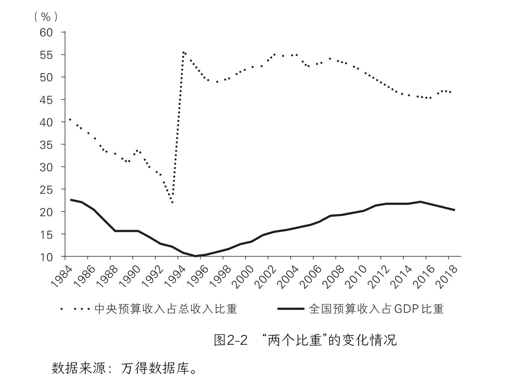
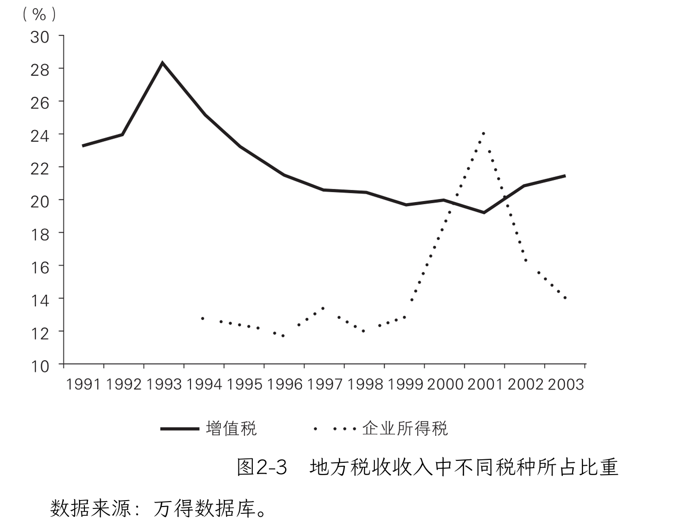

# 021 分税制改革

本节从1985年开始讨论财政改革。

## 1. 1985-1993（财政包干）

财政承包始于1980，中央和省级财政之间对收入和支出进行包干，地方可以留下一部分增收。1980—1984年是财政包干体制的实验阶段，1985年以后全面推行，建立了“分灶吃饭”的财政体制。

### 不同地方的承包机制

承包的具体机制各有不同。

常见的形式是“收入递增包干”。例如1988年的北京，是以1987年的财政收入为基数，设定一个固定的年收入增长率4%，超过这部分的增收归北京，没超过的部分则与中央五五分成。

广东的机制更加简单，1988年向中央上缴14亿元，以后每年在此基础上增加9%。（当时广东的收入增速远超9%，大概达到了14%，上缴的负担越来越轻。且1988年的14亿元只占当年收入108亿元的13%。）

上海的负担则很重，实行”定额上解“的原则。每年向中央上缴105亿元。（1988年，上海的预算收入是162亿元，上解105亿元，占比 65%，财政压力很大。）

### 地方扩大税收来源

财政承包制下，交完了中央的，剩下的都是地方自己的，因此地方有动力扩大税收来源，大力发展经济。

乡镇企业：

* 增值税（增值税改革前也叫产品税）：企业只要开工生产，不管盈利与否都得交增值税，规模越大缴税越多，所以县政府有很强的动力做大、做多乡镇企业。
* 上缴利润：
    * 主要交给乡镇政府和村集体作为预算外收入
    * 当时乡镇企业享受税收优惠，所得税和利润税都很低，1980年的利润税仅为6%，1986年上升到20%，所以企业税后利润可观。

### 对当时财政制度的评价

好处：

20世纪80年代是改革开放的起步时期，在很多根本性制度尚未建立、观念尚未转变之前，各类承包制有利于调动全社会的积极性，推 动社会整体走出僵化的计划经济，让人们切实感受到收入增长，逐渐转变观念。

问题：

但也正是因为改革转型的特殊性，很多承包制包括财政包干制注定不能持久。财政包干造成了“两个比重”不断降低：

* 中央财政预算收入占全国财政预算总收入的比重越来越低
    * 原因：地方经济增长快于上缴数额的增长
* 全国财政预算总收入占GDP的比重也越来越低。
    * 地方政府减少上缴预算：由于央地分成没几年就要谈一次，地方为了避免税收收入增长很快，而导致下次谈判落入不利地位（更高的上缴基数和更吃亏的分成比例），有意限制预算收入的增长。
    * 地方政府“藏富于企业”：地方预算内的收入要和中央进行分成，如果给企业免税以减少预算内收入，“藏富于企业”，再使用其它行政收费、集资、摊牌、赞助等手段收回来，就能避免与中央进行分成。
    * 总结：地方给企业减税，税收自然会变少，但是预算外的收入却迅猛增加，使得全国财政预算总收入占GDP比重越来越低。

不仅中央变得越来越穷， 财政整体也越来越穷。

### 改革的需求

“两个比重”的下降严重削弱了国家财政能力，不利于推进改革。 

经济改革让很多人的利益受损，中央必须有足够的财力去补偿，才能保障改革的推行，比如国企改革后的职工安置、裁军后的退伍军人转业等。

而且像我国这样的大国，改革后的地区间发展差异很大（东中西部差异、城乡差异等），要创造平稳的环境，就需要缩小地区间基本公共服务差异，也需要中央财政的大量投入，否则连推行和保障义务教育都有困难。如果中央没钱，甚至要向地方借钱，那也就谈不上宏观调控的能力。

正如时任财政部部长的刘仲藜所言： 毛主席说，“手里没把米，叫鸡都不来”。中央财政要是这样的状态，从政治上来说这是不利的，当时的财税体制是非改不可了。…

## 2. 分税制改革与央地博弈

1994年的分税制改革把税收分为三类：

* 中央税（如关税）
* 地方税（如营业税）
* 共享税（如增值税）。

### 税务机构

同时分设国税、地税两套机构，与地方财政部门脱钩，省以下税务机关以垂直管理为主，由上级税务机构负责管理人员和工资。

分析：这种设置可以减少地方政府对税收的干扰，保障中央税收收入，但缺点也很明显：两套机构导致税务系统人员激增，提高了税收征管成本，而且企业需要应付两套人马和审查，纳税成本也高。2018年，分立了24年的国税与地税再次开始合并。

### 增值税（1994）

分税制改革中最重要的税种是增值税，占全国税收收入的1/4。

改革之前，增值税（即产品税）是最大的地方税；改革后变成共享税，中央拿走75%，留给地方25%。

>案例：假如改革前的1993年，地方增值税收入为100亿元，1994年改革后增长为110亿元，那么按照新税制，地方拿25%，收入一下就从1993年的100亿元下降到了27.5亿元。

#### 增值税 -- 税收返还机制与突击征税

为防止地方收入急剧下跌，中央设立了“税收返还”机制：保证改革后地方增值税收入与改革前一样，新增部分才和中央分。

1994年， 地方可以拿到102.5亿元，而不是27.5亿元。因此改革后增值税占地方税收收入的比重没有急速下跌，而是缓慢地逐年下跌（图2-3）。

在央地博弈中，税收返还机制的实施最终决定将“基年”定为税制改革的当年。而距离年底还有几个月，地方政府为了保证自己的利益，会采取突击征税的方式，以增加未来的税收返还：

* 将过去拖欠未收上来的税一次性收上来
* 将未来的税挪到今年来收，提高税收基数

>由于地方突击征税，图2-3中增值税占地方税收的比重在1993年出现了明显反常的尖峰。这让1994年的财政陷入了困境，中央承诺的税收返还因为数额剧增而无法到位，预算迟迟做不出来。这些问题又经过了很多协商和妥协才解决。但从图2-3可以看到，当2001年推行所得税分成改革时，突击征税现象再次出现。

### 企业所得税（2001）

企业所得税是我国的第二大税种，2018年占全国税收收入的 23%。2002年改革之前，企业所得税按行政隶属关系上缴：中央企业交中央，地方企业交地方。

#### 企业所得税 -- 地方保护主义

地方企业比中央企业多，所以六成以上的所得税交给了地方。

地方政府自然就有动力创办价高利大的企业，比如烟厂和酒厂，这些都是创税大户。20世纪90年代，各地烟厂、酒厂越办越多，很多地方只抽本地牌子的烟、喝本地牌子的啤酒，这种严重的地方保护主义不利于形成全国统一市场，也不利于缩小地区间的经济差距。

#### 改革方向

在2002年的所得税改革中，除一些特殊央企的所得税归中央外，所有企业的所得税中央和地方六四分成（仅2002年当年为五五分）。为防止地方收入下降，同样也设置了税收返还机制，并把2001年的所得税收入定为返还基数。

#### 企业所得税 -- 税收返还机制与突击征税

所以2001年的最后两个月，地方集中征税做大基数，财政部和国务院办公厅不得不强调“地方各级人民政府要从讲政治的高度，进一步提高认识，严格依法治税，严禁弄虚作假。2002年1月国务院有关部门将组织专项检查，严厉查处作假账和人为抬高基数的行为。对采取弄虚作假手段虚增基数的地方，相应扣减中央对地方的基数返还，依法追究当地主要领导和有关责任人员的责任。”但从图2-3中可以看出，2001年不正常的企业所得税收入依然非常明显。

## 总结

分税制是20世纪90年代推行的根本性改革之一，也是最为成功的改革之一。改革扭转了“两个比重”不断下滑的趋势：

* 中央占全国预算收入的比重从改革前的22%一跃变成55%，并长期稳定在这一水平；
* 国家预算收入占GDP的比重也从改革前的11%逐渐增加到了20%以上。

改革大大增强了中央政府的宏观调控能力，为之后应付一系列重大冲击（1997年亚洲金融危机、2008年全球金融危机和汶川地震等）奠定了基础，也保障了一系列重大改革（如国企改革和国防现代化建设）和国家重点建设项目的顺利实施。分税制也从根本上改变了地方政府发展经济的模式。