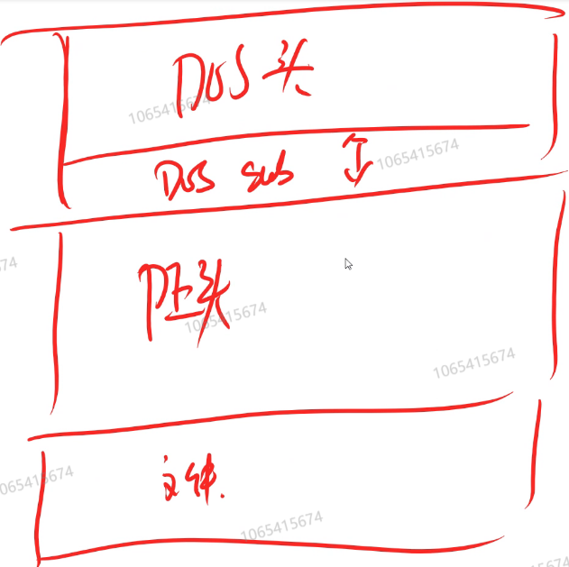

## PE文件的基本格式与解读方式

#### 1.PE文件

Windows系统下的.exe/.o等文件都是PE文件

#### 2.PE文件的基本格式

> 由于Windows系统为了给DOS系统做兼容，在PE文件的开头会先进入一个DOS头，之后进入PE头，中间是一个不确定大小的DOS SUS部分。后面是文件具体内容。



#### 3.如何分析PE文件

> 思路：首先，找到PE头。其次在PE头里找到PE文件的基址。

##### 3.1 DOS头的结构

```C++
//<winnt.h>
typedef struct _IMAGE_DOS_HEADER {      // DOS .EXE header
    WORD   e_magic;                     // Magic number
    WORD   e_cblp;                      // Bytes on last page of file
    WORD   e_cp;                        // Pages in file
    WORD   e_crlc;                      // Relocations
    WORD   e_cparhdr;                   // Size of header in paragraphs
    WORD   e_minalloc;                  // Minimum extra paragraphs needed
    WORD   e_maxalloc;                  // Maximum extra paragraphs needed
    WORD   e_ss;                        // Initial (relative) SS value
    WORD   e_sp;                        // Initial SP value
    WORD   e_csum;                      // Checksum
    WORD   e_ip;                        // Initial IP value
    WORD   e_cs;                        // Initial (relative) CS value
    WORD   e_lfarlc;                    // File address of relocation table
    WORD   e_ovno;                      // Overlay number
    WORD   e_res[4];                    // Reserved words
    WORD   e_oemid;                     // OEM identifier (for e_oeminfo)
    WORD   e_oeminfo;                   // OEM information; e_oemid specific
    WORD   e_res2[10];                  // Reserved words
    LONG   e_lfanew;                    // File address of new exe header
  } IMAGE_DOS_HEADER, *PIMAGE_DOS_HEADER;
```

> 由微软公司定义的结构体就是DOS头的内容。该结构体名字为`IMAGE_DOS_HEADER`。

其中，最后一个成员`e_lfanew`决定了PE头的位置。其余的成员是在DOS系统下的数据，无关。

##### 3.2 计算PE头的地址

计算公式：Address(PE) = Address(DOS) + e_lfanew

(PE头的地址 = DOS头的地址 + e_lfanew的值)

```C++
void* pDOS = ();
void* pPE = pDOS + *(pDOS + (sizeof(IMAGE_DOS_HEADER) - sizeof(IMAGE_DOS_HEADER.e_lfanew)));
```

##### 3.3 PE头的结构简介

> PE头里包含一个基址（PE文件开始地址）和一个入口点地址（相对基址的偏移量），将这两者加起来就是真正入口点的实际地址。

**注意：**

> [PE文件的基址是指程序编译时每个模块的优先加载地址](https://blog.csdn.net/nicehunt/article/details/38977907)[1](https://bing.com/search?q=PE文件+基址+重复)[2](https://blog.csdn.net/nicehunt/article/details/38977907)[3](https://blog.csdn.net/u012206617/article/details/88185628)[。如果程序没有被加载到预期的基址，就需要进行基址重定位，修复一些数据的地址](https://blog.csdn.net/nicehunt/article/details/38977907)[2](https://blog.csdn.net/nicehunt/article/details/38977907)[4](https://blog.csdn.net/weixin_43249758/article/details/115214160)[。不同PE文件的基址可能会重复，因为多个DLL文件使用调用其本身的EXE文件的地址空间](https://blog.csdn.net/qq_45444695/article/details/104195547)[5](https://blog.csdn.net/qq_45444695/article/details/104195547)[。如果出现基址冲突，系统会自动分配一个新的基址给DLL文件](https://blog.csdn.net/nicehunt/article/details/38977907)[2](https://blog.csdn.net/nicehunt/article/details/38977907)。

```C++
//<winnt.h>
//这个是PE头的结构体
typedef struct _IMAGE_NT_HEADERS {
    DWORD Signature;							//ASCII "PE"
    IMAGE_FILE_HEADER FileHeader;				//机器的基本信息，暂不研究
    IMAGE_OPTIONAL_HEADER32 OptionalHeader;		//主要的研究地方，定义在下方
} IMAGE_NT_HEADERS32, *PIMAGE_NT_HEADERS32;


//主要研究的结构体，里面注意的信息：AddressOfEntryPoint
typedef struct _IMAGE_OPTIONAL_HEADER {
    //
    // Standard fields.
    //

    WORD    Magic;
    BYTE    MajorLinkerVersion;
    BYTE    MinorLinkerVersion;
    DWORD   SizeOfCode;
    DWORD   SizeOfInitializedData;
    DWORD   SizeOfUninitializedData;
    DWORD   AddressOfEntryPoint;			//PE文件的基址信息
    DWORD   BaseOfCode;
    DWORD   BaseOfData;

    //
    // NT additional fields.
    //

    DWORD   ImageBase;
    DWORD   SectionAlignment;
    DWORD   FileAlignment;
    WORD    MajorOperatingSystemVersion;
    WORD    MinorOperatingSystemVersion;
    WORD    MajorImageVersion;
    WORD    MinorImageVersion;
    WORD    MajorSubsystemVersion;
    WORD    MinorSubsystemVersion;
    DWORD   Win32VersionValue;
    DWORD   SizeOfImage;
    DWORD   SizeOfHeaders;
    DWORD   CheckSum;
    WORD    Subsystem;
    WORD    DllCharacteristics;
    DWORD   SizeOfStackReserve;
    DWORD   SizeOfStackCommit;
    DWORD   SizeOfHeapReserve;
    DWORD   SizeOfHeapCommit;
    DWORD   LoaderFlags;
    DWORD   NumberOfRvaAndSizes;
    IMAGE_DATA_DIRECTORY DataDirectory[IMAGE_NUMBEROF_DIRECTORY_ENTRIES];
} IMAGE_OPTIONAL_HEADER32, *PIMAGE_OPTIONAL_HEADER32;
```

##### 3.4 使用API获取入口点地址

```C++
#include <ImageHlp.h>
#pragma comment(lib,"imagehlp.lib")

CStringA GameExeA;				//单字节的CString，存储PE文件路径
GameExeA = GameExe;				//将多字节的CString做类型转换
PLOADED_IMAGE image = ImageLoad(GameExeA, NULL);		//调用API,同时将文件加载到image指向的缓冲区
DWORD dEntryPoint = image->FileHeader->OptionalHeader.AddressOfEntryPoint;	//获取入口点地址
ImageUnload(image);				//释放缓冲区
```

##### 3.5 自定义函数来获取入口点地址（类似上面的loadimage）

> 将文件读取进来，并分配内存（优化空间思路：可以直接读取文件中的值，不需要全部读取后再获取值）

```C++
void* _imageload(wchar_t* filename)
{
	std::ifstream streamReader(filename, std::ios::binary);
	streamReader.seekg(0, std::ios::end);		//游标移到文件结尾
	unsigned filesize = streamReader.tellg();			//获取游标当前位置 - 文件开始位置，此处为文件大小
	char* _data = new char[filesize];					//分配内存
	streamReader.seekg(0, std::ios::beg);		//跳转回开始
	streamReader.read(_data, filesize);		//读取文件
	streamReader.close();
	return _data;
}

void _unloadimage(void* _data)
{
	delete[] _data;
}

```

> 调用自定义函数读取文件内容，利用结构体指针强转，先获取DOS头的e_lfanew值。再据此找到PE头，获取到入口点地址。

```C++
void* image = _imageload(GameExe.GetBuffer());		

IMAGE_DOS_HEADER* dosHeader = (IMAGE_DOS_HEADER*)image;
unsigned PEAddress = dosHeader->e_lfanew + unsigned(image);

IMAGE_NT_HEADERS* ntHeader = (IMAGE_NT_HEADERS*)PEAddress;
DWORD dEntryPoint = ntHeader->OptionalHeader.AddressOfEntryPoint;

_unloadimage(image);
```