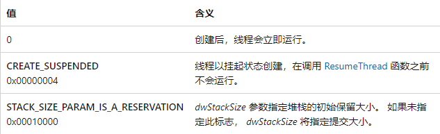

## 获得代码执行权限

> 在别的进程中执行代码，既要能够开辟空间来创建对应的代码，另一方面要能使这段代码能执行。方法一是在原有的执行频繁的函数附近劫持线程，使之跳转到这段代码处。另一种方法是创建另一个线程，使该线程执行这段代码。

#### CreateRemoteThread函数

> 为了能在其它进程中创建线程，需要用该函数来创建。

```C++
HANDLE CreateRemoteThread(
  [in]  HANDLE                 hProcess,
  [in]  LPSECURITY_ATTRIBUTES  lpThreadAttributes,
  [in]  SIZE_T                 dwStackSize,
  [in]  LPTHREAD_START_ROUTINE lpStartAddress,
  [in]  LPVOID                 lpParameter,
  [in]  DWORD                  dwCreationFlags,
  [out] LPDWORD                lpThreadId
);
```

**参数**

* hProcess：需要创建线程的进程句柄
	* 注意：句柄必须具有**PROCESS_CREATE_THREAD**、**PROCESS_QUERY_INFORMATION、PROCESS_VM_OPERATION**、**PROCESS_VM_WRITE**和**PROCESS_VM_READ**访问权限
* lpThreadAttributes：默认为NULL
* dwStackSize：堆栈的初始大小（以字节为单位）
	* 如果此参数为 0 (零) ，则新线程将使用可执行文件的默认大小
* lpStartAddress：该线程执行的函数指针
	* 指向由线程执行的 **LPTHREAD_START_ROUTINE** 类型的应用程序定义函数的指针，表示远程进程中线程的起始地址。 函数必须存在于远程进程中。
* lpParameter：上面函数参数的地址
* dwCreationFlags：控制线程创建的标志（指明线程创建后的状态）



* lpThreadId：指向接收线程标识符的变量的指针。
	* 如果此参数为 **NULL**，则不返回线程标识符。