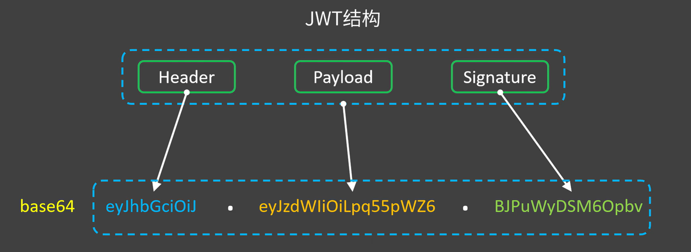

# JWT详解

## 1. JWT结构

* Header：一般是将一个json用base64编码后的字符串（一般是固定的，alg可能会是别的算法）

    ```json
    {
        "alg": "HS256",
        "typ": "JWT"
    }
    ```

* Payload：一般存放一些不敏感的通用信息，同样用base64编码的json

    ```json
    {
        "iss": "yunyin",		// 发布者
        "iat": "1746092381",	// 发布时间戳
        "exp": "1746095978",	// 过期时间戳
        "uid": 18438872409		// 其它不敏感的信息，例如用户ID等
    }
    ```

* Signature：对前两部分拼接后，再用HS256算法进行加密

    ```python
    Signature = HS256(base64(header_json) + '.' + base64(payload_json), key)
    ```

上述三部分生成完成之后，再使用点号拼接，就成为了JWT：

```python
JWT = base64(header_json) + '.' + base64(payload_json) + '.' + Signature
```



## 2. JWT是明文而非密文

敏感信息不要存储在JWT中，因为它是明文，客户端可直接看到json里的值。

base64只是一种编码算法，而非加密算法，在js中直接用atob()函数就能解码：

```js
atob('eyJhbGciOiJIUzI1NiIsInR5cCI6IkpXVCJ9')
> '{"alg":"HS256","typ":"JWT"}'
```